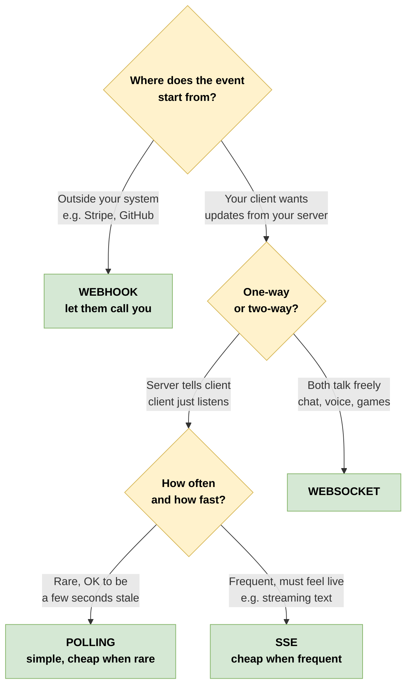

# Real-Time Communication Patterns - A Practical Guide

> Polling, Webhooks, Server-Sent Events, and WebSockets. What they are, when to use them, and how to build them. Written so you can read it once and keep it as a reference forever.

---

## Who this guide is for

This guide assumes you can write a bit of code and have heard the words "client" and "server" but does **not** assume you've ever built anything real-time before. If you can build a simple website that shows a list of things, you have enough background to read every page in this folder.

By the end you will be able to:

- Recognise which real-time pattern an app you're using is built on (often just by watching its network tab)
- Pick the right pattern for a feature you're designing without overthinking it
- Build a small working example of each pattern in your favourite language
- Talk about latency, scale, and cost trade-offs the way the people who already build this stuff do

You don't have to read this front to back. Each file is self-contained. But if you're starting from scratch, the numbered order is the gentlest path.

---

## The big problem we're solving

The web was originally designed around one beautifully simple idea:

> **The browser asks. The server answers. Done.**

You type a URL, the browser sends a request, the server sends back a page, the conversation ends. This is called HTTP, and it powers basically everything you do online. It's brilliant for "show me a page" but it has one serious limitation:

**The server cannot say anything to you unless you ask first.**

That sounds reasonable until you think about what modern apps actually do:

- **Slack** shows your friend's message the moment they hit send. You didn't ask. How does Slack know to tell you?
- **Uber** shows the car moving down the map. You didn't keep clicking refresh. How is your phone getting position updates?
- **Stripe** charges a customer's card and your inventory system marks the item as sold. Nobody clicked anything. How did your system find out?
- **ChatGPT** types out its answer one word at a time. You only sent the question once. Why does the answer come in pieces?
- **Google Docs** shows your colleague's cursor moving as they edit. Nobody refreshed. How are both browsers in sync?

Each of these is "the server has something new and wants the client to know about it now." That's the real-time problem. And there are exactly four solutions in common use.

---

## The four patterns - meet the cast

Think of them like four ways to keep in touch with a friend:

| Pattern | Real-life analogy | One-line definition |
|---------|------------------|---------------------|
| **Polling** | Calling your friend every 10 minutes to ask "any news?" | The client keeps asking the server on a timer |
| **Webhooks** | Your friend has your phone number; they call you when something happens | One server makes an HTTP request to another server when an event fires |
| **SSE (Server-Sent Events)** | Tuning your radio to a news station that keeps broadcasting | The server holds an HTTP connection open and pushes updates down it |
| **WebSockets** | A phone call where either of you can talk anytime | A persistent two-way channel between client and server |

That's the entire universe of "how to get real-time updates" in modern web/mobile apps. Everything else - push notifications on your phone, gRPC streaming, MQTT, Kafka - is a variation or a specialisation of one of these four.

The whole point of this guide is to help you tell them apart and pick correctly.

---

## A scenario we'll keep coming back to

To make all this concrete, we'll use one running example throughout the guide. Meet our cast:

- **Maya** is a backend developer at a startup called **LiveOrder**, a food delivery app.
- **Raj** is a hungry customer who just ordered biryani.
- **Priya** owns the restaurant that received Raj's order.
- **Sam** is the delivery driver who will pick up the food and bring it to Raj.

The LiveOrder app has to coordinate between all four of them in real time:

| Feature | Who needs to be told | Which pattern fits |
|---------|---------------------|---------------------|
| Raj's payment is confirmed by Stripe | LiveOrder backend | **Webhook** (Stripe calls Maya's server) |
| Priya's restaurant tablet shows the new order pop up | Priya | **SSE** (server pushes to restaurant) |
| Raj's phone shows "preparing... ready... out for delivery" | Raj | **SSE** (server pushes to user) |
| Raj can chat with Sam about apartment buzzer code | Raj and Sam | **WebSocket** (two-way chat) |
| Raj's map shows Sam's scooter moving | Raj | **SSE** or fast polling |
| Maya's dashboard checks if a long batch job (computing tomorrow's pricing) is done | Maya | **Polling** (low frequency, batch) |

One app. All four patterns. None of them is "better" than the others - each one fits a different shape of problem.

By the time you finish this guide, you'll be able to look at a new feature and say "ah, that's a webhook" or "this is begging for SSE" with the same confidence Maya does.

---

## The 30-second mental model

Before going deep, lock in this picture. It will save you hours of debating in design meetings:



Save this picture in your head. You will reach for it constantly.

---

## How to read this guide

```
concepts/
├── 00_overview.md            ← you are here
├── 01_http_fundamentals.md   ← prerequisite: how the web actually talks
├── 02_polling.md             ← simplest pattern, start here for code
├── 03_webhooks.md            ← inversion: server calls you
├── 04_sse.md                 ← streaming from server to client
├── 05_websockets.md          ← full duplex, the heavyweight option
├── 06_decision_matrix.md     ← when to pick what, with rationale
└── 07_ai_agents_mcp.md       ← where these show up in modern AI apps
```

**Suggested paths:**

| If you are... | Read this order |
|---------------|----------------|
| New to web development | 01 → 02 → 03 → 04 → 05 → 06 → 07 |
| A working backend dev | 02 → 03 → 04 → 05 → 06, skim 01 and 07 |
| Mostly building AI apps | 04 → 07 → 03 → 06, others as needed |
| Just want to pick a pattern fast | 06, then the doc for the pattern you picked |

The diagrams folder (`../diagrams/`) has the same content as visual draw.io files if you prefer a deck-style read. The examples folder (`../examples/`) has runnable code for each pattern - read the docs first, then run the examples, then build the projects.

---

## A few notes before we start

**This is a guide, not a spec.** When we say "WebSockets close after 60 seconds of no traffic," that's a common production reality, not a rule from the WebSocket RFC. If you need exact specs for a compliance reason, the RFCs are linked at the end of each file.

**Code is in Python and JavaScript.** Not because they're best, but because they're the most widely readable. Patterns translate to any language with HTTP and async I/O.

**Numbers are rounded for intuition.** "100k WebSockets cost 10-20 GB of RAM" is rule-of-thumb sizing, not a benchmark. Your mileage will vary based on framework, kernel tuning, message size, and what your server does between messages.

**We try to be opinionated.** Where most teams make a predictable mistake (reaching for WebSockets when SSE is enough; building polling without a cursor; deploying webhooks without idempotency), we'll say so. You're free to disagree.

Alright. To the next page.
