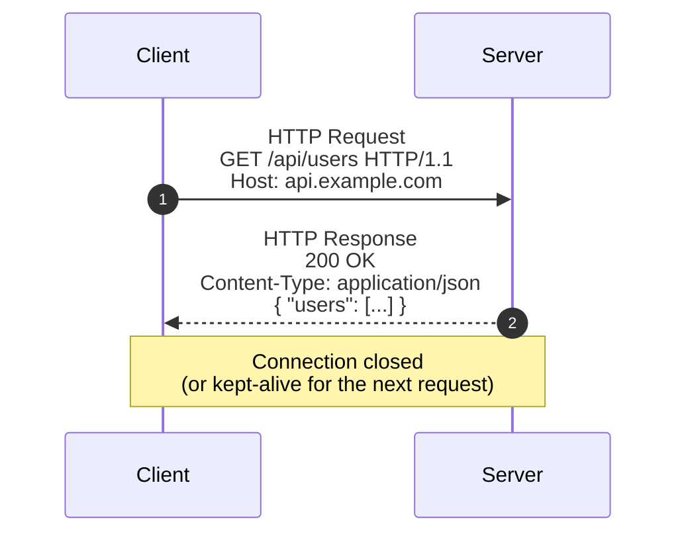
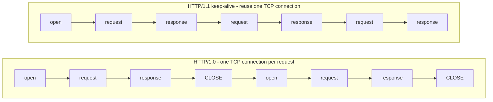

# 1. HTTP Fundamentals

> **Why this is here:** You can't really understand polling, webhooks, SSE, or WebSockets without a solid grip on what HTTP does and doesn't give you. This is the foundation everything else builds on.

---

## 1.1 The HTTP request/response cycle

HTTP is a **request/response** protocol. The client (your browser, your app, `curl`) opens a connection to the server, sends a request, the server sends back a response, and that's it - the interaction is over.



### Anatomy of a request

```
GET /api/users?page=2 HTTP/1.1   ← method, path, version
Host: api.example.com             ← headers
Accept: application/json
Authorization: Bearer eyJhb...

                                   ← blank line, then optional body
```

### Anatomy of a response

```
HTTP/1.1 200 OK                   ← version, status code, status text
Content-Type: application/json    ← headers
Content-Length: 348

{"users":[{"id":1,...}]}          ← body
```

### Status codes (the ones that matter for real-time)

| Code | Meaning | When you'll see it |
|------|---------|-------------------|
| 200  | OK | Successful poll, successful webhook receipt |
| 202  | Accepted | "Got your request, processing async" (webhook receivers) |
| 204  | No Content | "Nothing new" (short polling) |
| 304  | Not Modified | Caching - useful for polling efficiency |
| 400  | Bad Request | Malformed webhook payload |
| 401/403 | Auth issues | Webhook signature wrong, missing token |
| 408  | Request Timeout | Long polling hit timeout - client should reconnect |
| 429  | Too Many Requests | You're polling too aggressively, back off |
| 500/502/503 | Server errors | Webhook sender should retry these |

---

## 1.2 Stateless vs Stateful

**Stateless** means: each request is independent. The server doesn't remember anything between requests. If you want context preserved, **you** (the client) must send it again - usually via cookies, tokens, or request bodies.

HTTP is stateless. This is on purpose: stateless servers are easier to scale because any server in a pool can handle any request.

**Stateful** means: the connection itself carries memory. The server knows "this is the same client I was talking to 30 seconds ago" without needing them to re-authenticate every request.

### Where each pattern lands

| Pattern | Connection model | Stateless or stateful? |
|---------|------------------|------------------------|
| Polling (short) | New HTTP request per poll | **Stateless** - server treats each poll independently |
| Polling (long) | One HTTP request held open until data | Stateless from server's view; one-shot from client's view |
| Webhooks | Separate HTTP request per event | **Stateless** |
| SSE | One long-lived HTTP connection | **Stateful** at the transport level (server keeps track of who's connected) |
| WebSockets | One persistent connection, both directions | **Stateful** |

### Why this matters

Stateful connections cost server resources. Each open WebSocket or SSE stream holds a file descriptor, memory for buffers, and (usually) an in-process subscription. A single Node.js process might handle 10,000 concurrent connections; a poorly tuned one will fall over at 1,000.

Stateless requests can be load-balanced across any number of servers - but they pay round-trip cost on every request.

---

## 1.3 Persistent connections

By default, HTTP/1.0 closed the TCP connection after each response. HTTP/1.1 introduced **keep-alive**: reuse the same TCP connection for many request/response cycles.



This is what makes **long polling** and **SSE** work efficiently - they piggyback on keep-alive to hold one connection open for a long time.

WebSockets go further: they **upgrade** an HTTP connection to a different protocol entirely, then both sides can send bytes whenever they want.

---

## 1.4 HTTP/2 and HTTP/3 (briefly)

- **HTTP/2** multiplexes many requests over one connection. SSE works well over HTTP/2 - you can have many SSE streams to the same host without exhausting the 6-connection-per-domain limit of HTTP/1.1.
- **HTTP/3** runs over QUIC (UDP). All of these patterns still work; the underlying transport is faster and survives network changes better.

For this workshop, the concepts are the same regardless of HTTP version - but in production, HTTP/2 changes some scaling constraints in your favor.

---

## 1.5 Why the request/response model isn't enough

The fundamental limitation of vanilla HTTP: **the server cannot initiate a conversation**. The client must always ask first.

This is fine for "fetch a page" but breaks down when:
- The server has data the client doesn't know to ask for yet (a new chat message, a price change)
- Work happens asynchronously and the client wants to know when it's done
- Two parties need to exchange messages frequently (live game, collaborative editor)

The four patterns we'll cover are all answers to this limitation:

- **Polling**: client asks repeatedly (the brute-force workaround)
- **Webhooks**: server-to-server callback (push, but only between backends)
- **SSE**: server can push to client, but only one-way
- **WebSockets**: both can push, anytime

---

## Quick check: things to remember

- HTTP is **request/response**, **stateless** by default
- Status codes matter - `204`, `304`, `408`, `429`, `5xx` are the ones you'll handle in real-time code
- Keep-alive lets multiple requests share one TCP connection
- The four patterns we'll learn are all answers to: *"how do we beat the request/response limitation?"*
