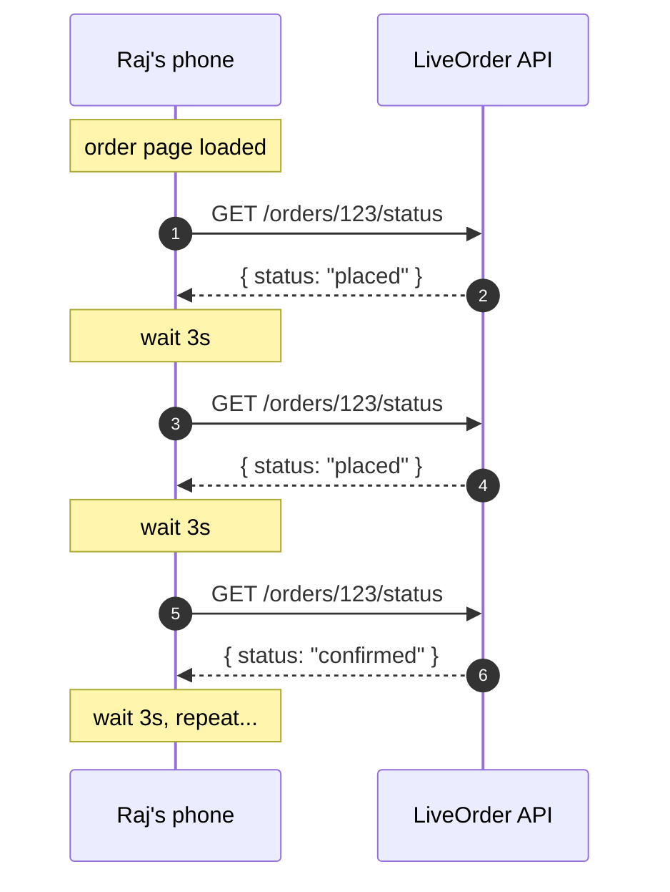
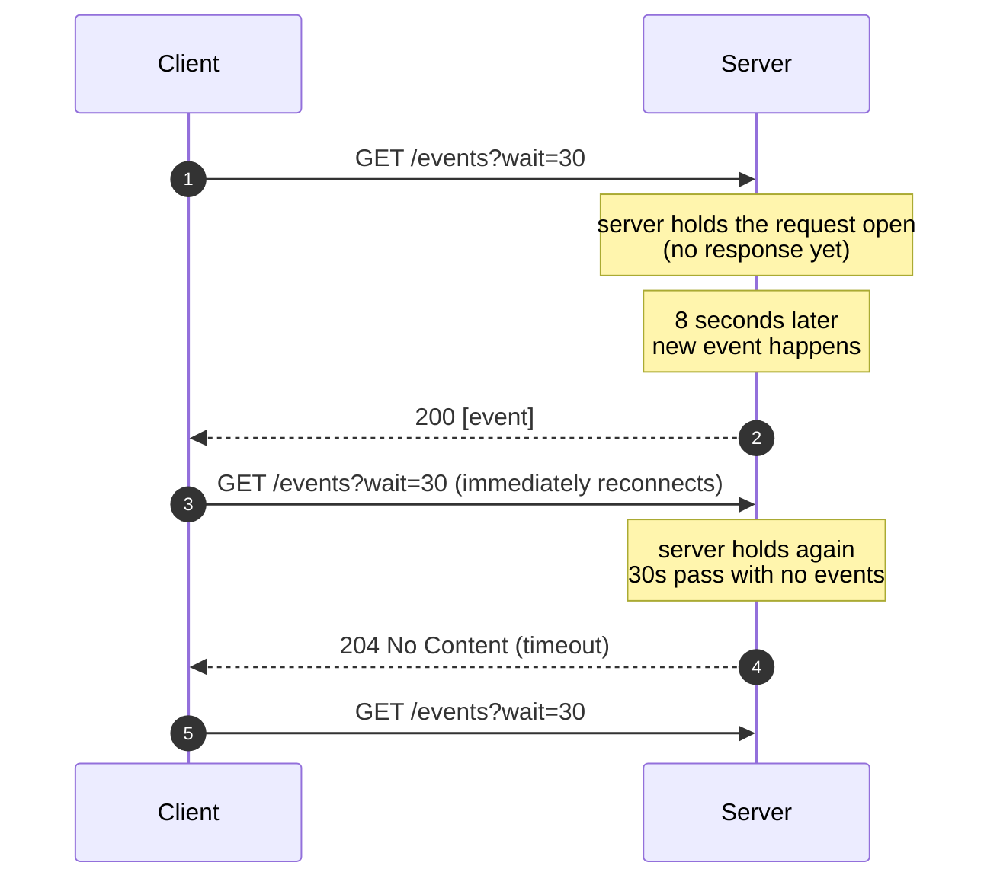

# 2. Polling - "Are we there yet?"

> The simplest way to fake real-time. The client just keeps asking the server "anything new?" on a timer. Crude, sometimes wasteful, but often exactly right.

---

## What you'll learn

- The two flavours of polling (short polling and long polling) and how they differ
- A real scenario where polling is the right call, and one where it's a disaster
- How to make polling cheaper with cursors, backoff, and conditional requests
- When to graduate to SSE or WebSockets instead

---

## 2.1 The analogy that's going to stick with you

You're driving on a road trip with a 5-year-old in the back seat.

The kid is excited. Every two minutes:

> "Are we there yet?"
> "No."

Two more minutes:

> "Are we there yet?"
> "No."

Two more minutes:

> "Are we there yet?"
> "Yes!"

That is polling. The kid (client) keeps asking. You (server) answer immediately with whatever the current state is. Most of those questions get "no" and were "wasted" - but eventually the question lines up with the arrival and the kid gets the news.

**Long polling** is a small twist: instead of answering immediately, you say "I'll let you know when we're there." Then you stay silent for a while and only speak up when you arrive. The kid asked the question once, you took your time answering, but the answer was meaningful.

Both work. Both are polling. The difference is who decides when to reply.

---

## 2.2 Why polling exists

Recall from the HTTP chapter: the server can't speak first. So the client takes matters into its own hands - it asks. Repeatedly. On a timer.

It is dumb. It is wasteful when nothing is happening. It is also dead simple to build, works through every firewall, and requires zero infrastructure you don't already have. **Don't be embarrassed about polling.** Plenty of huge companies use it for the right things.

---

## 2.3 Maya's first polling feature

Back to LiveOrder. Maya is building Raj's "Track my order" screen. After Raj places an order, the screen needs to show the status as it changes: **placed → confirmed by restaurant → cooking → out for delivery → delivered.**

Maya's first instinct: just have the screen ask the backend every couple of seconds.



She writes the client side in about 8 lines of JavaScript:

```javascript
let lastStatus = null;
const interval = setInterval(async () => {
  const res = await fetch(`/orders/${orderId}/status`);
  const { status } = await res.json();
  if (status !== lastStatus) {
    updateOrderUI(status);
    lastStatus = status;
  }
  if (status === "delivered") clearInterval(interval);
}, 3000);  // poll every 3 seconds
```

And the server side is even shorter:

```python
@app.get("/orders/{order_id}/status")
def get_status(order_id: int):
    order = db.get_order(order_id)
    return {"status": order.status}
```

This is **short polling**. It ships in 30 minutes. It works.

Does it work *well*? Let's see what's actually happening behind the scenes.

---

## 2.4 The hidden cost of short polling

Raj's order takes about 25 minutes from placement to delivery. The status changes maybe **5 times** in that period (placed → confirmed → cooking → out for delivery → delivered).

Raj's phone is polling every 3 seconds, so:

- **Total polls during the order**: 25 minutes × 20 polls/minute = **500 polls**
- **Polls that returned a new value**: **5**
- **Polls that returned the same value**: **495**

That's a **99% waste rate.** Now multiply by 10,000 simultaneous customers and Maya is paying for 5 million HTTP requests per hour just to track order statuses, of which 99% returned nothing useful.

Each of those requests does real work:
- Network round trip (latency)
- TLS handshake reuse (some CPU)
- Auth token validation (DB or cache lookup)
- Database query for the order
- JSON serialisation
- A log line in the access log

At Maya's scale, this turns into noticeable cloud bills and CPU. Worse, the status change Raj cares about - say, "out for delivery" - might happen one second after a poll, meaning Raj waits the full 3 seconds before he sees it. The user experience feels laggy.

This is the polling trade-off in one sentence:

> **Lower the poll interval → smoother UX, higher cost. Raise the interval → cheaper, laggy UX. You cannot win both.**

---

## 2.5 Making short polling less terrible

Maya can do better without changing patterns. A few standard tricks:

### 1. Don't poll faster than you have to

If the status only changes every 3-5 minutes, polling every 30 seconds gives the user a reasonable feel and cuts request volume by 10×.

### 2. Use cursors so responses are deltas

Right now Maya returns the **current state** every time. A better endpoint returns **what's new since I last asked**:

```python
@app.get("/orders/{order_id}/events")
def get_events(order_id: int, since: int = 0):
    events = db.get_events(order_id, after_sequence=since)
    return {"events": events, "next": (events[-1].seq if events else since)}
```

The client tracks the last `next` it received and sends it in the next poll. Most polls return `{"events": [], "next": 47}` - basically empty, very cheap to produce.

### 3. Use HTTP conditional requests

If your endpoint is cacheable, return an `ETag`:

```python
return Response(json, headers={"ETag": f'"{order.version}"'})
```

The client sends `If-None-Match: "<previous etag>"` on the next poll. If nothing changed, the server returns `304 Not Modified` with **no body**. Same protocol, dramatically less bandwidth.

### 4. Back off when nothing's happening

If five polls in a row returned nothing, slow down. Exponential backoff: 3s → 6s → 12s → 30s. Reset to 3s the moment something new arrives. Saves a huge number of requests during idle phases.

### 5. Add jitter

If every client polls "every 30 seconds starting from app launch", they will eventually sync up to the same wall-clock seconds and create traffic spikes. Add a small random offset (±10%) to the interval. This sounds trivial but has saved many a backend from self-DDOS during outage recovery.

### 6. Pause when invisible

Use the browser's Page Visibility API to stop polling when the tab isn't visible. There's no point updating a UI no one is looking at.

```javascript
document.addEventListener("visibilitychange", () => {
  if (document.hidden) clearInterval(handle);
  else startPolling();
});
```

With all six tricks Maya's polling becomes orders of magnitude cheaper without abandoning the pattern.

---

## 2.6 Long polling - the smarter cousin

If Maya wants near-real-time without giving up on HTTP, there's a clever variation: **long polling**.

The idea: instead of the server answering immediately and the client sleeping, the **server keeps the request open and answers only when it has something new** (or when it gives up after a timeout, typically 30 seconds). The client immediately fires another request as soon as it gets a response.



The same status-tracking, switched to long polling, would look like this on the server:

```python
import asyncio
from fastapi import FastAPI

app = FastAPI()
order_events: dict[int, asyncio.Queue] = {}

def queue_for(order_id: int) -> asyncio.Queue:
    return order_events.setdefault(order_id, asyncio.Queue())

@app.get("/orders/{order_id}/wait")
async def wait_for_change(order_id: int):
    q = queue_for(order_id)
    try:
        event = await asyncio.wait_for(q.get(), timeout=30.0)
        return {"event": event}
    except asyncio.TimeoutError:
        return Response(status_code=204)  # nothing happened, client reconnects

# elsewhere, when the order's status actually changes:
async def on_order_status_change(order_id: int, new_status: str):
    await queue_for(order_id).put({"status": new_status})
```

What changes for Raj's experience:

- **Latency drops to near zero.** The moment Priya marks the order "confirmed," Maya's server pushes the response down the open connection. Raj sees it within ~50 ms.
- **Request volume drops by 10-100×.** During a 25-minute order, instead of 500 requests, Raj's phone makes maybe **30** (a handful per minute due to the 30s timeout, plus one per status change).
- **The trade-off** is server-side complexity. Maya's server now has to hold open lots of connections simultaneously without burning a thread for each. That's why she's using `async`/`await`. In a synchronous framework like classic Flask, this would fall over at ~20 simultaneous orders.

### The proxy timeout trap

Long polling has one classic bug. Cloud load balancers usually time out idle connections somewhere between 30 and 60 seconds. If Maya sets her server-side timeout to 60 seconds and the AWS load balancer is set to 30, the LB will kill the connection mid-poll. The client sees an error. So:

> **Set your server timeout to be lower than the load balancer's timeout.** A good rule: server `wait=25s`, LB `idle_timeout=60s`. That leaves a comfortable margin.

---

## 2.7 When polling is the right choice

It is fashionable to roll one's eyes at polling. Resist. Polling is correct when:

| Situation | Why polling fits |
|-----------|-----------------|
| **You're talking to an external API you don't control.** | The OpenAI Batch API, fine-tuning jobs, S3 Glacier - all polled, because they don't push to you. |
| **The thing you're checking changes rarely.** | A batch job runs nightly. Polling every minute costs 60 requests; setting up SSE is overkill. |
| **The cost of being a few seconds stale is zero.** | A dashboard showing yesterday's sales numbers. |
| **You have very few clients.** | Internal admin tool used by 5 people; 500 polls/hour total is rounding-noise. |
| **You're on a network or platform that doesn't support long-lived connections.** | Some corporate proxies cut connections aggressively; iOS background fetch quietly kills long-lived connections; many serverless platforms have aggressive idle limits. |
| **You're the entire dev team and shipping in three days.** | Polling is the only pattern you can build, test, deploy, and debug in an afternoon. |

---

## 2.8 When polling is the wrong choice

| Situation | Why it goes badly |
|-----------|-------------------|
| **The UI must feel "live" - chat, typing indicators, multiplayer.** | Sub-100ms feel is impossible without unsustainable polling rates. |
| **Mostly-idle clients that just occasionally need an event.** | You'll burn cycles on millions of empty requests for the few that matter. SSE or webhooks would do zero work in idle. |
| **Strict cost budget at scale.** | At 10K+ concurrent users, every poll-per-second adds real money. |
| **You're polling someone else's quota-limited endpoint.** | Burning 1 request per second on Stripe's API will get you rate-limited and your bill yelled at. |
| **You're polling every 100 ms because "real-time."** | You have reinvented streaming with extra steps and worse latency. Just use SSE. |

---

## 2.9 Common bugs (and how to debug them)

### "I'm polling but the data never updates"

99% of the time, this is **caching**. Browsers and CDNs are aggressive about caching GET responses. Add `Cache-Control: no-store` to your poll endpoint's response, or include a cache-buster like `?t=<timestamp>` in the URL.

### "My long-poll request times out at 30 seconds even though I set 60"

A proxy in the middle (your LB, your CDN, a corporate firewall) is killing idle connections. Use a packet trace or browser network tab to confirm. Bring your server timeout below the proxy's.

### "Polling works in dev but explodes in production"

In dev you had 1 user (yourself). In prod you have 10,000. You forgot a cache somewhere, or your DB query is N+1 (one query per poll instead of one batched query). Add metrics: requests-per-second per endpoint, DB query time per endpoint, request body size.

### "The client polls forever after the user closes the tab"

Make sure your `setInterval` is cleared on the matching teardown event (`beforeunload`, component unmount, etc.). If you're polling for a single task, also stop when the task completes (`if (status === 'done') clearInterval(handle)`).

### "My UI shows duplicate notifications"

Without a cursor/`since` parameter you're seeing the same events on every poll. Always poll for "events since last seen ID," not "all events." Track the cursor on the client.

---

## 2.10 Real-world appearances

You see polling everywhere once you know to look:

- **CI build status.** GitHub Actions, CircleCI, GitLab CI - the build status page is polling the build endpoint every few seconds.
- **OpenAI Batch / Fine-tuning APIs.** Submit a job, get an ID, then poll `/jobs/{id}` until status is `succeeded` or `failed`.
- **Stripe Checkout return URL.** After payment, your page often polls your backend until the webhook confirms the payment, so the UI can advance.
- **Many mobile apps' "pull to refresh."** That's polling with the user as the timer.
- **Cron-style data jobs.** "Every minute, ask the source DB for new rows since timestamp X." That's polling.
- **Cloud function status APIs.** AWS Lambda async invocations, Google Cloud Run job runs - poll for `state`.

---

## 2.11 Cheat sheet

- **Short polling**: client asks on a fixed timer. Simple, works everywhere, wasteful when idle.
- **Long polling**: client asks, server holds the request until data arrives (or timeout). Cheaper when idle, lower latency, needs async server, watch for proxy timeouts.
- **Make polling cheaper**: cursor (`since=N`), `ETag`/`304`, exponential backoff, jitter, pause when invisible.
- **Use it when**: data updates rarely, the external API only supports polling, you need to ship in an afternoon, or staleness up to a few seconds is fine.
- **Avoid it when**: you need sub-100 ms latency, you have 10K+ idle clients, or you're polling at 10+ Hz.
- **Default upgrade path**: short polling → long polling → SSE → WebSockets, in that order of complexity.

---

## Mental model recap

**Polling = client keeps asking.** Don't make it ask faster than necessary, don't make it ask for data it already has, and turn it off when nobody's looking. Done well, polling is invisible. Done badly, polling is the reason your AWS bill doubled last month.

Next page: webhooks. The exact opposite pattern - someone else's server calls *your* server.
