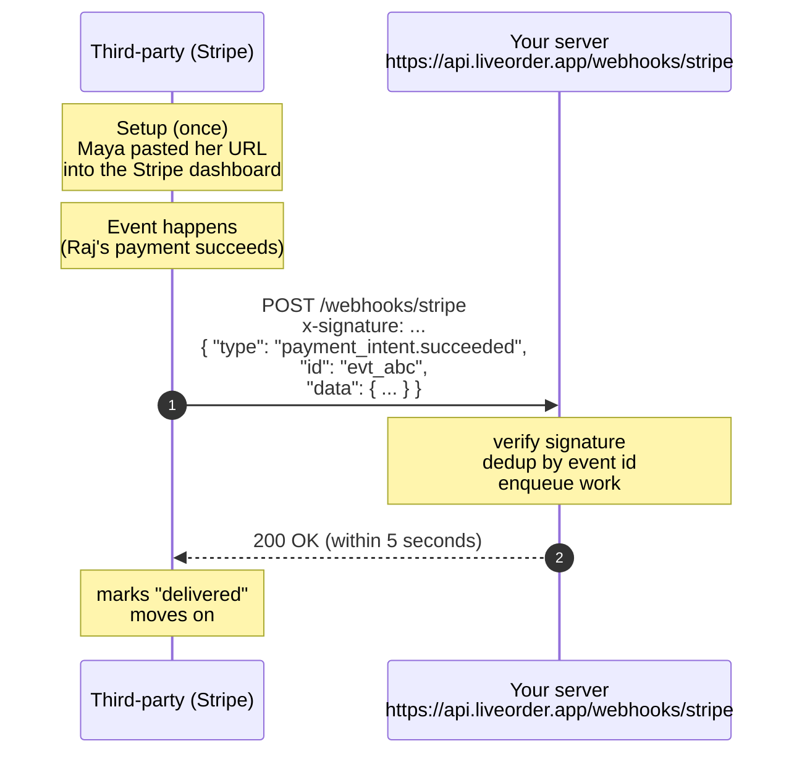
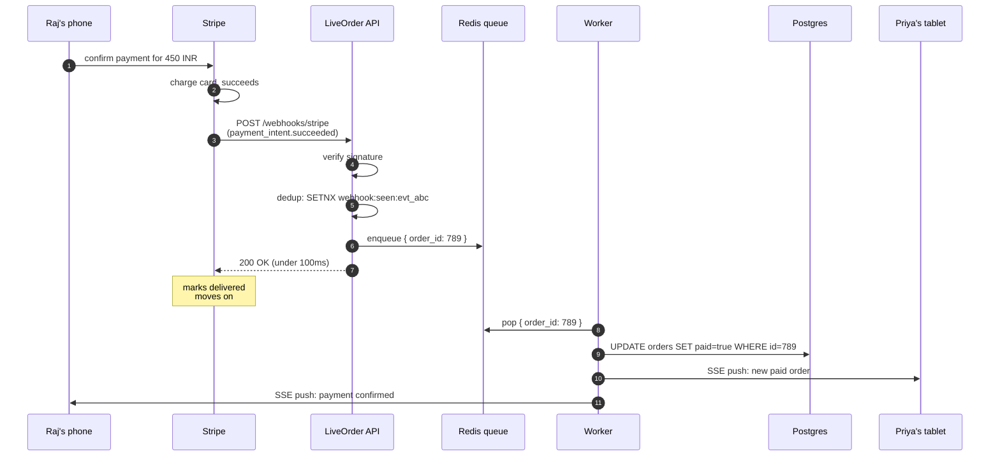

# 3. Webhooks - "Don't call us, we'll call you"

> The complete inverse of polling. Instead of you asking someone's server for updates, **their** server makes an HTTP request to **yours** the moment something happens. Webhooks are how Stripe tells you about payments, how GitHub tells you about pull requests, and how Slack tells your bot about messages.

---

## What you'll learn

- What a webhook actually is, with the wire format spelled out
- A complete worked example: Maya wires up Stripe webhooks for LiveOrder
- The four non-negotiable rules every webhook receiver must follow (and what breaks if you don't)
- How to test webhooks locally without exposing your laptop to the internet
- Common bugs and how to debug them

---

## 3.1 The analogy

You're waiting for a package. You have two ways to find out when it arrives:

- **Polling**: every 5 minutes, you go outside and check if the box is on the porch. Tiring. Often pointless. You'll see it shortly after it arrives, but not the moment.
- **Webhook**: you set up a Ring doorbell. The delivery person presses the button. Your phone buzzes the instant the package is dropped. Zero idle effort.

A webhook is the doorbell. You install it once (give the delivery service your "URL"), and then they ring it (POST to your URL) when something happens.

---

## 3.2 The mechanics

A webhook is literally just an HTTP POST request. There's nothing exotic about it. The trick is *who is the client and who is the server*:

- In polling: **you** are the client, **they** are the server. You GET from them.
- In webhooks: **they** are the client, **you** are the server. They POST to you.

That role flip is the entire idea.



That's it. The third party's server makes an HTTP request to a URL you gave them. Your server reads it, returns 200, and that's the whole exchange.

---

## 3.3 Maya wires up Stripe

LiveOrder takes payment with Stripe. When Raj pays for his biryani, Stripe charges his card, and Maya's backend needs to know so she can:

1. Mark the order as paid in her own database.
2. Notify Priya's restaurant tablet that a new (paid) order is coming.
3. Email Raj a receipt.

Without webhooks, Maya would have to poll Stripe's API ("any new payments for me?") which would be wasteful and slow. With webhooks, Stripe just calls her.

### Step 1: Maya tells Stripe where to call

In her Stripe dashboard, Maya goes to **Developers → Webhooks** and adds:

```
URL:    https://api.liveorder.app/webhooks/stripe
Events: payment_intent.succeeded, payment_intent.payment_failed, charge.refunded
```

Stripe gives her a **signing secret** that looks like `whsec_abcdef1234...`. She stores this in her server's environment variables. **This secret is the proof that requests are really from Stripe.**

### Step 2: Maya builds the receiver

```python
import hmac, hashlib, json, os
from fastapi import FastAPI, Request, HTTPException

app = FastAPI()
STRIPE_SECRET = os.environ["STRIPE_WEBHOOK_SECRET"]
seen_events: set[str] = set()  # in production, this would be Redis

def verify_stripe_signature(body: bytes, header: str, secret: str) -> bool:
    # Stripe sends: t=<timestamp>,v1=<hmac>
    parts = dict(p.split("=", 1) for p in header.split(","))
    signed_payload = f"{parts['t']}.{body.decode()}".encode()
    expected = hmac.new(secret.encode(), signed_payload, hashlib.sha256).hexdigest()
    return hmac.compare_digest(expected, parts["v1"])

@app.post("/webhooks/stripe")
async def stripe_webhook(req: Request):
    body = await req.body()
    sig_header = req.headers.get("stripe-signature", "")

    # 1. Verify it's really from Stripe
    if not verify_stripe_signature(body, sig_header, STRIPE_SECRET):
        raise HTTPException(401, "bad signature")

    event = json.loads(body)

    # 2. Dedup - Stripe will sometimes send the same event twice
    if event["id"] in seen_events:
        return {"received": True, "duplicate": True}
    seen_events.add(event["id"])

    # 3. Enqueue the real work and return 200 immediately
    await background_queue.put(event)

    return {"received": True}
```

That's the entire production-shape webhook receiver. 22 lines. Now let's understand why each piece is there.

---

## 3.4 The four non-negotiable rules

If you take nothing else from this page, take these four. Skipping any of them turns webhooks into a silent disaster.

### Rule 1: Return 2xx fast

Webhook senders have a tight timeout - typically **5 to 10 seconds**. If you don't respond in time, they consider the delivery failed and will retry. So:

- **Don't do the actual work inside the handler.** Don't call your database, don't send emails, don't call other APIs. All of that can take seconds to minutes.
- **Validate, queue, return.** Validate the signature (microseconds), dedup the event (a Redis SET, microseconds), put the event in a background queue (microseconds), return `200`.

The actual processing - charging your inventory, notifying the restaurant, emailing Raj - happens **after** the handler has returned, in a worker process that pulls from the queue.

Why this matters: if you do work synchronously, a slow database query or a third-party API hiccup will cause Stripe to timeout, mark the delivery as failed, and retry. Now you have the **same payment processed twice** unless your idempotency (Rule 3) is bulletproof. And your error rate dashboards will be on fire.

### Rule 2: Verify the signature

Your webhook URL is public. Anyone with a `curl` command can POST anything to it. Without signature verification, an attacker can:

```bash
curl -X POST https://api.liveorder.app/webhooks/stripe \
  -H "content-type: application/json" \
  -d '{"type":"payment_intent.succeeded","data":{"object":{"amount":1000000,"customer":"cus_real_customer"}}}'
```

...and your server would happily mark a $10,000 order as paid. You would ship goods. You'd find out next month from your accountant.

This is not theoretical. Webhook endpoints are scanned routinely by bots. **Always verify the signature.**

Three details that matter:

1. **Use `hmac.compare_digest`**, not `==`. The standard equality operator short-circuits on the first differing byte, which leaks timing information an attacker can use to guess the signature character by character (a "timing attack"). `compare_digest` does a constant-time comparison.

2. **Sign the timestamp + body together**, not just the body. Otherwise an attacker who captures a single valid request can replay it forever. Reject requests with timestamps older than ~5 minutes.

3. **Verify against the raw body bytes**, not the parsed JSON. JSON parsing can reorder keys or change whitespace, breaking the HMAC. In FastAPI: `body = await req.body()`, then pass that to verification.

### Rule 3: Be idempotent (dedup by event ID)

Webhook senders **will sometimes deliver the same event twice or more**, even if your server returned 200. Possible reasons:

- Your 200 response was lost in the network.
- The sender retried while your response was in flight.
- Internal queue retries on the sender's side.

Stripe is explicit about this in their docs: **"We strongly recommend that you make your event processing idempotent."**

The standard pattern: every event has a unique `id` (Stripe's is `evt_...`). Before processing, check if you've seen this ID. If yes, skip processing and still return 200.

```python
if event["id"] in seen_events:
    return {"received": True, "duplicate": True}
seen_events.add(event["id"])
```

In a real system, replace `seen_events` (a Python set) with:

- **Redis** with a TTL: `SETNX webhook:seen:evt_abc 1 EX 86400` returns 0 if it existed.
- **Database unique constraint**: `INSERT INTO webhook_events (id) VALUES ('evt_abc')` and catch the unique-violation error.

Both atomically test-and-set, so you don't get a race where two workers process the same event simultaneously.

### Rule 4: Don't return 5xx for things you can't fix

If you return any 5xx status, the sender retries - sometimes for days, with growing backoff. This is correct behaviour when the issue is transient (your DB is briefly down). But for permanent issues, retries are pure noise.

Examples of things to **return 200** for, with a log entry:

- "I don't care about this event type." (e.g. Stripe's `customer.created` if you only handle payments)
- "This event references an order I no longer have." (user deleted their account)
- "I parsed it but it doesn't match my schema." (the third party added a new field; the old code can ignore it)

Examples of things that **deserve a 5xx** so the sender retries:

- Your database is down for 30 seconds during a failover.
- An upstream API you call mid-processing is timing out (rare - usually you should queue and process async, then this wouldn't even be in the handler).

Conservative rule: **return 200 unless you're sure a retry would help.**

---

## 3.5 What's actually in the payload

Webhook payloads vary by sender but follow a common shape:

```json
{
  "id": "evt_1NXY2bAB4tH...",
  "type": "payment_intent.succeeded",
  "created": 1700000000,
  "data": {
    "object": {
      "id": "pi_3NXY...",
      "amount": 5000,
      "currency": "usd",
      "customer": "cus_abc123",
      "metadata": { "order_id": "order_789" }
    }
  },
  "livemode": true,
  "api_version": "2023-10-16"
}
```

The pattern:

- **`id`**: unique event ID. **Use this for dedup.**
- **`type`**: what happened. Your handler is a switch statement on this.
- **`data.object`**: the relevant resource at the moment the event fired. For a payment event, the PaymentIntent; for an order event, the Order.
- **`created`**: timestamp. Useful for ordering events that arrived out of order.
- **`api_version`**: the sender's API version. Important if you want to handle multiple versions gracefully.

A common antipattern: parsing `data.object.metadata.order_id` and assuming it's always present. **Metadata fields you didn't set are not guaranteed to exist.** Defensive parsing pays off:

```python
order_id = event.get("data", {}).get("object", {}).get("metadata", {}).get("order_id")
if not order_id:
    log.warning(f"webhook {event['id']} missing order_id")
    return {"received": True, "ignored": True}
```

---

## 3.6 Testing webhooks locally

The painful part of webhook development: **your laptop is not on the internet.** Stripe can't POST to `localhost:8000`. You need to expose your local server temporarily.

Three options, easiest to most production-like:

### Option 1: webhook.site (look only)

Go to https://webhook.site and you get a unique URL like `https://webhook.site/abc-123`. Configure your sender to use it. The webhook.site dashboard shows every request that arrives, full with headers and body. **You can't run your local code against it**, but you can inspect what the sender actually sends - useful for understanding payloads.

### Option 2: ngrok / Cloudflare Tunnel / Tailscale Funnel

These are tunnels that give you a public URL forwarding to your localhost.

```bash
ngrok http 8000
# → Forwarding   https://abc-123.ngrok.io → http://localhost:8000
```

Paste the ngrok URL into Stripe's webhook settings (`https://abc-123.ngrok.io/webhooks/stripe`) and now Stripe can call your local server. Combined with the ngrok web inspector (`http://localhost:4040`), you can see every request, replay it, etc.

### Option 3: Stripe CLI (works for Stripe specifically; many providers have similar)

```bash
stripe listen --forward-to localhost:8000/webhooks/stripe
```

This forwards *real* webhook events from your Stripe test account to localhost - no public URL needed. The CLI also handles signature setup automatically.

```bash
stripe trigger payment_intent.succeeded
```

...will fire a test event so you can iterate quickly. This is Maya's preferred workflow.

---

## 3.7 Maya's pipeline in production

Let's see the full path of one real payment in LiveOrder:



Notice the responsibilities:

- **API handler**: cheap, fast, just validates and queues. Returns to Stripe in under 100 ms.
- **Worker**: does the slow, retryable work. If the database is briefly down, the worker can retry without involving Stripe.
- **Multiple notifications cascading**: once the worker has the truth, it pushes to both Priya and Raj via SSE (we'll cover SSE next).

This separation is the secret to webhook systems that don't fall over.

---

## 3.8 If you're the sender (offering webhooks to your customers)

So far we've talked about *receiving* webhooks. If your company **sends** webhooks to customers, the responsibilities reverse:

- **Make registration easy.** Self-service UI + API, multiple URLs per account, ability to filter by event type.
- **Sign every payload.** Provide a signing secret per webhook endpoint. Document the algorithm.
- **Send the timestamp.** Include it in the signed payload, document the freshness window you expect receivers to enforce.
- **Retry with backoff.** Standard schedule: 1m, 5m, 15m, 1h, 6h, 12h, then give up after ~24h. Show retries in your dashboard.
- **Provide a "test event" button.** Receivers will use this constantly while developing.
- **Maintain a delivery log.** "Last 100 deliveries, status codes, response times, response bodies." Invaluable for support.
- **Treat sender-side bugs carefully.** If you fire 1M duplicate events overnight because of a bug in your code, you've caused 1M outages. Build internal rate limits.

---

## 3.9 Common bugs and how to debug them

### "Stripe says delivery failed but my server returned 200"

Likely cause: your 200 came *after* the timeout. Check your handler's processing time. If you do anything beyond "validate, dedup, enqueue" you'll hit timeouts under load. Move all real work to a worker.

### "I keep seeing duplicate processing"

Two possibilities:

1. Your dedup store doesn't actually work. Test it: send the same event twice and confirm the second returns `{duplicate: true}`. Watch for race conditions if you use a non-atomic check-then-set.
2. Your enqueue and dedup are in the wrong order. Always **dedup first**, then enqueue. Otherwise two simultaneous deliveries both pass dedup and both enqueue.

### "Verification keeps failing"

99% of the time: you parsed and re-serialised the body before hashing. Hash the **raw bytes** as they came over the wire. In FastAPI, that's `await req.body()` before any `await req.json()`.

Other 1%: wrong secret. Make sure you're using the right secret per environment (Stripe test vs Stripe live have different secrets).

### "Sometimes my dev server gets ngrok requests after I stopped working"

Webhook senders retry for hours or days. Restart ngrok before testing or your replay attacks will be hilarious in production. Better: use Stripe CLI which only forwards while running.

### "Events arrive out of order"

This happens. Don't rely on order. Each event should be self-contained: include the timestamp, the full current state, and process based on the absolute state rather than computing deltas. If you must order, sort by the `created` timestamp.

---

## 3.10 Real-world appearances

- **Stripe**: payments, refunds, disputes, subscriptions.
- **GitHub**: pull requests, pushes, issues, deployments. Used by every CI system.
- **Slack Events API**: messages, channel events, reactions. How chat bots work.
- **Twilio**: incoming SMS / call events.
- **Calendly / Cal.com**: meeting booked, cancelled.
- **Shopify**: orders, inventory updates.
- **Auth0 / Clerk / Supabase Auth**: user signed up, password changed.
- **OpenAI Batch API**: when a batch is done. (Polled today, often webhook-based in similar services.)
- **Your own service**: any time customers ask "can you POST when X happens?", they want a webhook.

---

## 3.11 Webhooks vs polling - cost in the same scenario

For Maya, deciding "payment notification: polling Stripe vs Stripe webhooks":

| | Polling Stripe every 10s | Stripe webhooks |
|---|---|---|
| **Requests per day per active order** | ~360 over 1 hour of active state | ~1 (the actual event) |
| **Latency from event → app update** | 5s average, 10s worst | <100ms |
| **Subject to Stripe rate limits** | Yes, painful at scale | No (Stripe pushes to you) |
| **Works while Maya's server is down** | Yes (next poll catches up) | Stripe retries for days |
| **Requires public URL** | No | Yes |
| **Engineering complexity** | Trivial | Medium (sign, dedup, queue) |

For payment notifications specifically, webhooks win hands-down. For "is my batch job finished?" against a service that doesn't support webhooks, polling wins by default.

---

## 3.12 Cheat sheet

- **Webhook** = third party POSTs to your URL when something happens.
- **Four rules**: return 2xx fast, verify the signature, dedup by event ID, return 200 (not 5xx) for things you can't fix.
- **Local testing**: ngrok / Cloudflare Tunnel / Stripe CLI / webhook.site.
- **Architecture**: handler is thin (validate + dedup + enqueue). Worker does the real work.
- **Best for**: payment events, repo events, calendar events, email events - anywhere the source of truth lives outside your system.
- **Worst for**: things only your own client knows about (UI clicks), or when the third party doesn't offer webhooks.

---

## Mental model recap

**Webhooks = server-to-server doorbell.** You install the doorbell once (give them your URL). They ring it when something happens. You answer quickly, dedup, and do the work later. Always check it's really them ringing, not someone in a mask pretending to be them.

Next page: SSE. We're back on the client/server axis, but instead of the client asking repeatedly, the server holds an HTTP connection open and pushes events down it as they happen.
