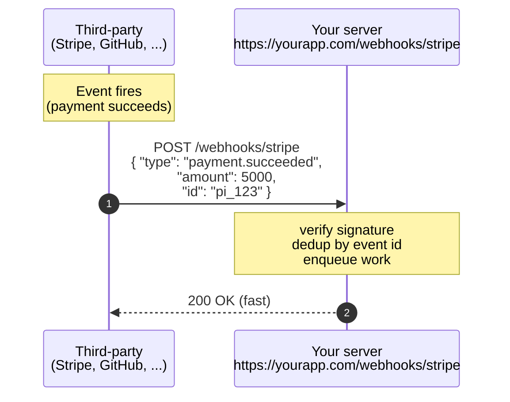

# 3. Webhooks

> **TL;DR:** A webhook is the inverse of polling - instead of you asking the server for updates, the server (or a third-party service) makes an HTTP POST to **your** URL the moment something happens. "Don't call us, we'll call you."

---

## 3.1 What is a webhook?

A webhook is just an HTTP endpoint **you** expose, that **someone else** calls when something interesting happens to them.



You configured your URL ahead of time in the third party's dashboard. They remember it and call it when relevant events fire.

### Webhooks vs polling - the inversion

| | Polling | Webhooks |
|--|---------|----------|
| Who initiates? | Client (you) | Server (the third party) |
| When does data flow? | Every interval | Only when something happens |
| Bandwidth on idle? | Wasteful | Zero |
| Setup | Just call the endpoint | Must expose a public URL, register it |
| Failure mode | Missed poll = you ask again | Missed delivery = lost event (unless retries) |

---

## 3.2 The lifecycle of a webhook

1. **Setup.** You give the third-party your URL (e.g., `https://api.yourapp.com/webhooks/stripe`).
2. **Event happens.** Customer pays $50 on Stripe.
3. **Stripe constructs an event.** `{ "type": "payment.succeeded", ... }`
4. **Stripe POSTs to your URL.** With signature headers for security.
5. **Your server receives.** Validates the signature, processes the event, returns `200 OK` (or `2xx` generally).
6. **Stripe records "delivered".** If your server returned non-2xx or timed out, Stripe retries.

---

## 3.3 The non-negotiables

### a) Respond fast

Webhook senders typically have a **5-10 second timeout**. If you can't respond by then, they consider it a failure and will retry.

**Rule:** *don't do the actual work in the webhook handler*. Validate, queue, return 200.

```python
@app.post("/webhooks/stripe")
async def stripe_webhook(req: Request):
    body = await req.body()
    verify_signature(body, req.headers["stripe-signature"])  # fast
    await background_queue.put(body)  # don't await actual processing
    return {"ok": True}  # return 2xx immediately
```

### b) Idempotency

Webhook senders **will sometimes deliver the same event twice**. Network blips, your server's slow response, retry-after-failure - many reasons.

Your handler must be **idempotent**: processing the same event twice has the same effect as processing it once.

Two common approaches:
1. **Dedup by event ID.** Most providers send a unique event ID. Store seen IDs (in Redis, DB) with a TTL. Skip if seen.
   ```python
   if redis.get(f"webhook:seen:{event_id}"):
       return {"ok": True, "duplicate": True}
   redis.setex(f"webhook:seen:{event_id}", 86400, "1")
   process(event)
   ```
2. **Make the side effect itself idempotent.** Use `INSERT ... ON CONFLICT DO NOTHING`, upserts, or check-then-set patterns.

### c) Signature verification

Anyone can POST anything to a public URL. If you trust webhook payloads without verification, attackers can fake "payment.succeeded" events and steal your goods.

Webhook senders sign the payload with a shared secret you set up during configuration. Your handler verifies the signature before trusting the body.

**Stripe-style:**
```python
import hmac, hashlib

def verify_signature(payload: bytes, header: str, secret: str) -> bool:
    # header format: t=<timestamp>,v1=<signature>
    parts = dict(p.split("=") for p in header.split(","))
    signed_payload = f"{parts['t']}.{payload.decode()}".encode()
    expected = hmac.new(secret.encode(), signed_payload, hashlib.sha256).hexdigest()
    return hmac.compare_digest(expected, parts["v1"])
```

Key details:
- Use `hmac.compare_digest`, not `==`, to avoid timing attacks
- Include a timestamp in the signed payload to prevent replay attacks (reject events older than 5 min)
- Never log the secret

### d) Retries

If you return non-2xx, the sender retries. Each provider has its own schedule:
- **Stripe:** retries for up to 3 days with exponential backoff
- **GitHub:** retries up to 3 times within 30 minutes (then disables the webhook!)
- **Slack:** ~3 retries, fast

This means:
- A bug that returns 500 will see the same event many times - your idempotency better work
- Don't return 5xx for events you intentionally want to reject (return 200 with a log instead)
- Have monitoring on webhook failure rates

---

## 3.4 The payload - what's in a webhook body

Conventional shape:

```json
{
  "id": "evt_1MZX2bAB4tH...",       // unique event ID - use for dedup
  "type": "payment_intent.succeeded", // what happened
  "created": 1700000000,              // timestamp
  "data": {                           // the relevant object
    "id": "pi_3MZX...",
    "amount": 5000,
    "customer": "cus_..."
  }
}
```

Headers usually carry:
- `X-Hub-Signature-256` / `Stripe-Signature` / `X-Webhook-Signature` - the HMAC
- `X-Event-Id` / `X-Delivery` - unique delivery ID
- `User-Agent` - identifies the sender
- `X-Event-Type` - sometimes the event type is in a header too

---

## 3.5 Receiving webhooks in local development

Your laptop is not on the public internet. Webhook senders can't reach `localhost:8000`. Options:

- **ngrok / cloudflared / tailscale funnel** - temporary public URL forwarding to localhost
  ```bash
  ngrok http 8000
  # → https://abc123.ngrok.io  (give this to Stripe)
  ```
- **Stripe CLI / Svix CLI** - forwards real webhook traffic from your account to localhost
  ```bash
  stripe listen --forward-to localhost:8000/webhooks/stripe
  ```
- **Webhook.site** - temporary URL that captures payloads in a browser dashboard (great for inspection)
- **Self-call** in tests - for unit tests, just POST to your own handler

---

## 3.6 Sending webhooks (you as the provider)

If your service offers webhooks to **your** customers:

- Make webhook config first-class (UI + API to register URLs)
- Sign every payload
- Implement retry with exponential backoff and a dead-letter store
- Provide event ID and timestamp in the payload
- Document the payload schema and event types
- Offer a test event firing UI
- Track delivery attempts in your DB for debugging

---

## 3.7 Where webhooks matter for AI / agents

- **GitHub PR opened → trigger code-review agent.** Webhook hits your backend, queues an agent run.
- **Stripe payment succeeded → trigger order-fulfillment agent.** Webhook → agent that emails receipt, updates inventory, etc.
- **Slack message → trigger conversation agent.** Slack webhook (Events API) delivers message events to your bot.
- **Calendar event created → trigger scheduling agent.** Google Calendar push notifications are webhooks.
- **Long-running agent finishes → calls back to your app.** If you orchestrate agents on a remote platform, the platform can webhook your URL with the result.
- **Background job pipeline.** Job 1 finishes → webhook → start job 2 (poor man's workflow engine).

---

## 3.8 Anti-patterns

- ❌ **Doing work synchronously in the handler.** Sender will time out and retry.
- ❌ **No signature verification.** Anyone can spoof events.
- ❌ **No idempotency.** You'll double-charge customers, send duplicate emails.
- ❌ **Returning 500 for "I don't care about this event."** Sender will retry forever. Return 200 + log.
- ❌ **Silent failures.** Wrap the handler in try/except that always returns 200 - you'll lose events and have no idea.
- ❌ **Tight coupling to sender's format.** If Stripe adds a field tomorrow, your strict schema parser will reject the whole payload. Be lenient on input.

---

## Mental model

**Webhooks = server tells another server.**
You give your URL once. They call it forever, every time something interesting happens. The trade-off vs polling: zero idle cost, but you must handle retries, dedup, and security yourself.
