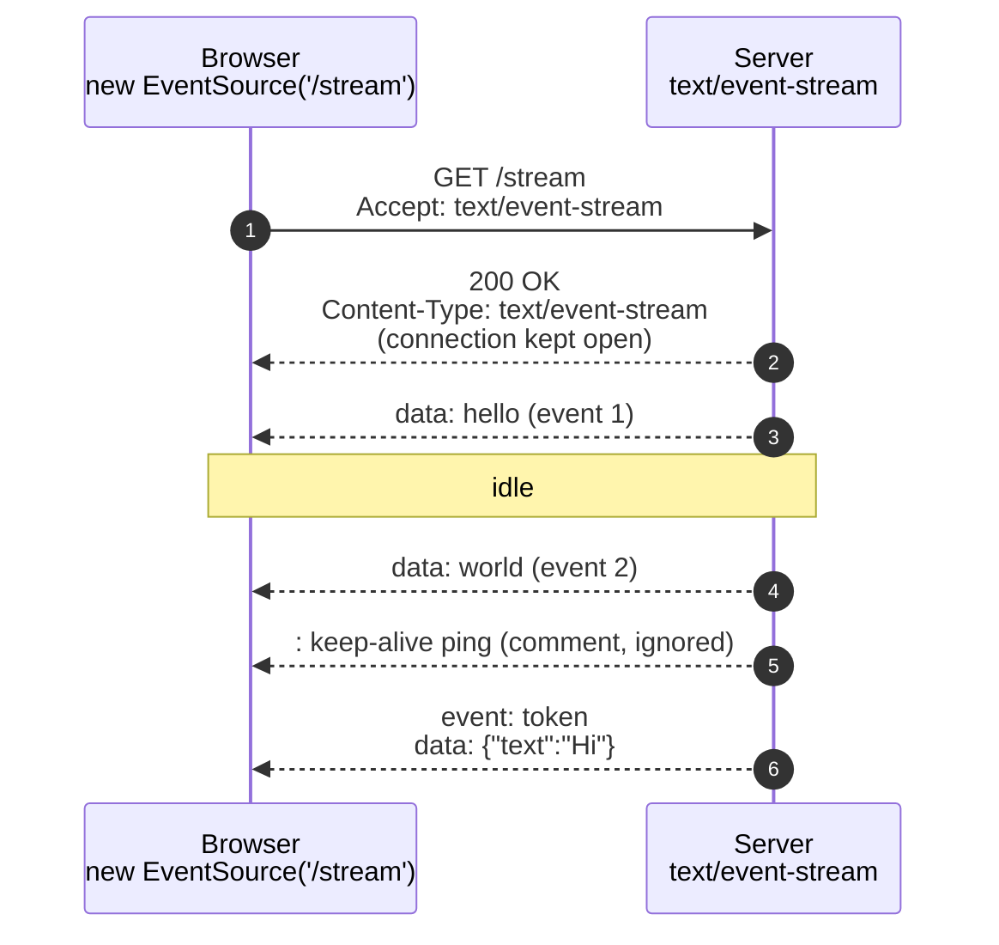
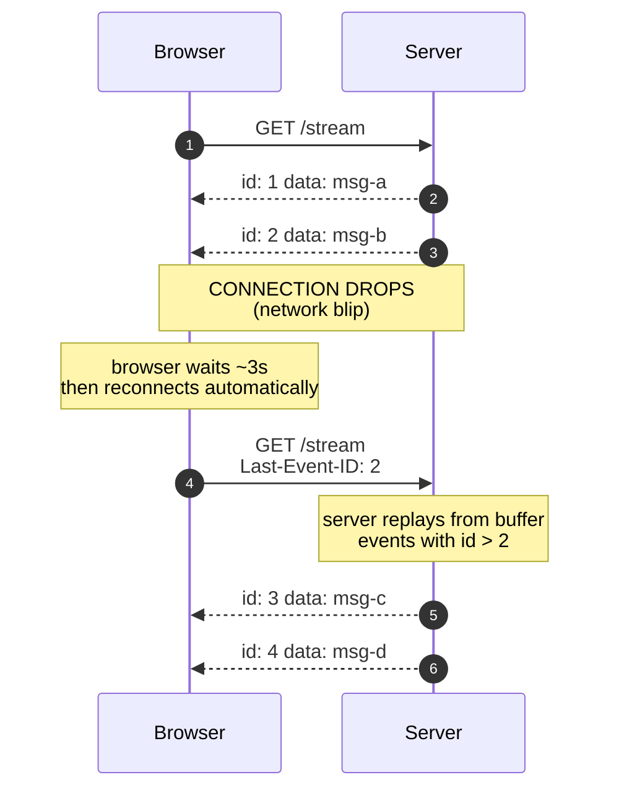

# 4. Server-Sent Events (SSE)

> **TL;DR:** SSE is a one-way stream from server to client over a single long-lived HTTP connection. It's built into every browser via the `EventSource` API, auto-reconnects, supports resume-on-disconnect, and is the easiest way to do server push. It's what powers ChatGPT's token-by-token streaming.

---

## 4.1 What is SSE?

The server keeps an HTTP connection open and sends events down it as they happen. The client reads the stream. **Server -> client only**, but no need for handshake gymnastics, no need for special infrastructure - it's just HTTP with `Content-Type: text/event-stream`.



---

## 4.2 The wire format

SSE messages are plain text. Each message is a block of lines, separated from the next by a blank line.

```
data: hello world

```

That's a complete event with the message `"hello world"`.

Full grammar:

```
event: <event-type>      ← optional, defaults to "message"
id: <event-id>           ← optional, for resume support
retry: <ms>              ← optional, tells client reconnect delay
data: <payload-line-1>   ← can repeat for multi-line data
data: <payload-line-2>
                         ← BLANK LINE = end of this event
```

### Examples

**Simplest:**
```
data: hi

```

**Named event:**
```
event: token
data: {"text": "Hello"}

```

**Multi-line data (gets joined with `\n`):**
```
data: line one
data: line two
data: line three

```

**With ID (lets client resume):**
```
id: 42
event: chunk
data: {"text": " world"}

```

**Comment / keep-alive:** any line starting with `:`. The client ignores it but it keeps the TCP connection warm.
```
: keep-alive ping

```

---

## 4.3 The client side - EventSource

Every modern browser has `EventSource` built in. No library needed.

```javascript
const es = new EventSource('/api/stream');

es.onopen = () => console.log('connected');

es.onmessage = (e) => {
  // fires for events with no `event:` line (default type "message")
  console.log('default message:', e.data);
};

es.addEventListener('token', (e) => {
  // fires for events with `event: token`
  const payload = JSON.parse(e.data);
  appendToken(payload.text);
});

es.onerror = (err) => {
  // EventSource auto-reconnects by default, this just logs
  console.error('stream error', err);
};
```

### What EventSource gives you for free

- **Auto-reconnect.** When the connection drops, the browser reconnects automatically (default ~3s delay).
- **Last-Event-ID.** On reconnect, the browser sends `Last-Event-ID: <id>` header with the last ID it saw, so your server can resume from there.
- **No special API.** Just `addEventListener` like any DOM event.

### What it doesn't give you

- **Cannot send data back to the server.** It's one-way. Use a separate `fetch()` POST for client→server.
- **Headers are not customizable in the browser API.** No `Authorization` header on `EventSource`. Workarounds: cookie auth, or query string token (less ideal), or use the [`event-source-polyfill`](https://github.com/Yaffle/EventSource) library.
- **Binary not supported.** SSE is text only. Use base64 or send a URL and let the client fetch separately.

---

## 4.4 The server side - minimal SSE

**FastAPI / Python:**
```python
import asyncio
from fastapi import FastAPI
from fastapi.responses import StreamingResponse

app = FastAPI()

@app.get("/stream")
async def stream():
    async def event_generator():
        for i in range(10):
            yield f"data: chunk {i}\n\n"
            await asyncio.sleep(1)
        yield "event: done\ndata: complete\n\n"

    return StreamingResponse(event_generator(), media_type="text/event-stream")
```

**Things the server MUST do:**
- Set `Content-Type: text/event-stream`
- Disable response buffering (nginx: `X-Accel-Buffering: no`; FastAPI handles this for `StreamingResponse`)
- End each event with `\n\n`
- Don't gzip the stream (or use `Cache-Control: no-cache`)

**Things the server SHOULD do:**
- Send periodic keep-alives (`: ping\n\n`) every 15-30s to keep proxies from closing the connection
- Set `Cache-Control: no-cache, no-transform`
- Include event IDs when resumability matters

---

## 4.5 Resuming after disconnect



This is opt-in on the server side - you need to look at the `Last-Event-ID` header and replay messages with higher IDs (from a buffer, log, or pubsub).

---

## 4.6 SSE in modern AI apps

This is *the* protocol for streaming LLM output:

- **OpenAI streaming.** `stream=True` returns an SSE stream of token chunks.
  ```
  data: {"choices":[{"delta":{"content":"Hello"}}]}

  data: {"choices":[{"delta":{"content":" world"}}]}

  data: [DONE]

  ```
- **Anthropic streaming.** Same shape, different chunk schema.
- **Model Context Protocol (MCP) servers.** The original transport was SSE. The newer "Streamable HTTP" still uses SSE-style chunked responses for server→client events.
- **Agent progress streaming.** "Thinking… searching web… reading 3 docs…" - each step pushed as an SSE event.
- **Live dashboards.** Server pushes new metrics every few seconds.

### Why SSE wins for LLM streaming (vs WebSockets)

- The use case is **one-way** (server → user). You don't need bidirectional.
- `EventSource` is built into the browser. No client library.
- It's just HTTP - works through corporate proxies, no upgrade dance.
- Auto-reconnect with Last-Event-ID is exactly the right primitive for resuming a stream.
- Easier to load-balance (still HTTP requests, just long ones).

---

## 4.7 Common gotchas

- ❌ **Forgetting the blank line.** `data: hi\n` without the trailing `\n` will hang - the client is waiting for the end-of-event marker.
- ❌ **Buffering proxy.** nginx defaults to buffering - you'll see all your events arrive at once at the end. Set `X-Accel-Buffering: no`.
- ❌ **No keep-alive comments.** Some load balancers close idle connections after 30-60s. Send `: ping\n\n` every 15s.
- ❌ **Holding many SSE connections in a sync framework.** Same problem as long polling - needs async I/O.
- ❌ **Trying to do auth via custom header.** Browser `EventSource` doesn't support custom headers. Use cookies or polyfill.
- ❌ **Sending binary.** SSE is text. If you need binary, encode (base64) or use WebSockets.

---

## 4.8 SSE vs WebSocket - quick contrast

| | SSE | WebSocket |
|--|-----|-----------|
| Direction | Server → client only | Both directions |
| Protocol | Plain HTTP | HTTP upgrade to `ws://` |
| Browser API | `EventSource` (built in) | `WebSocket` (built in) |
| Auto-reconnect | Yes, built in | No, do it yourself |
| Binary support | No | Yes |
| Auth headers in browser | No | No (but at least cookies work) |
| Through proxies | Almost always works | Sometimes blocked |
| Server resource per connection | One HTTP connection | One TCP connection |
| Good for | LLM streaming, dashboards, notifications | Chat, games, collaboration |

---

## Mental model

**SSE = server pushes a faucet of events down one HTTP pipe.**
Client just opens it once with `new EventSource(url)` and listens. The browser handles reconnects. Use it whenever the use case is genuinely one-way (most "live updates" are).
