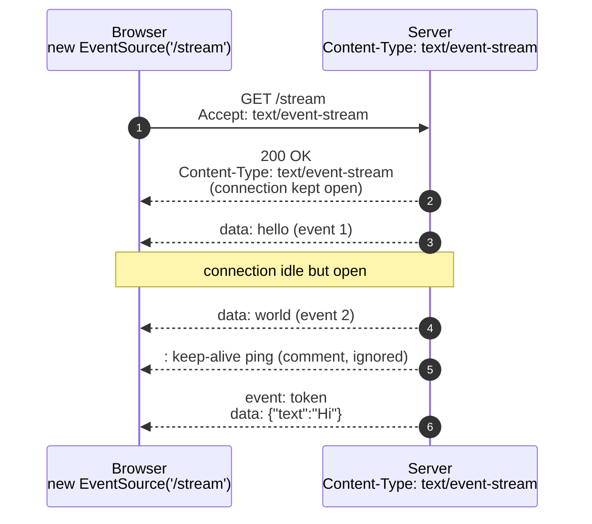
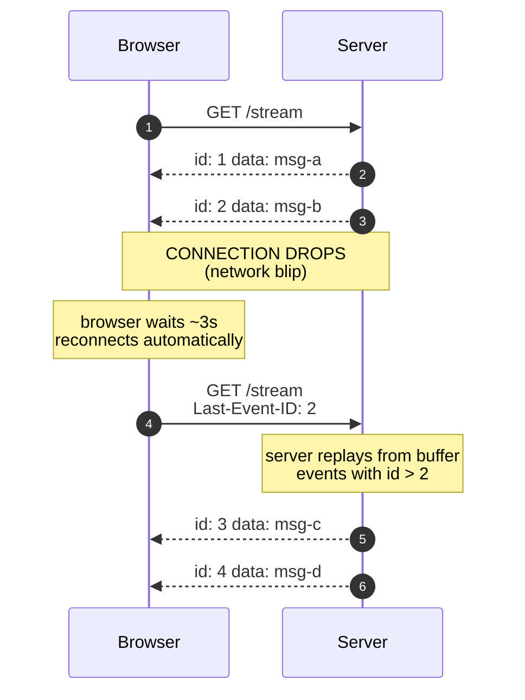

# 4. Server-Sent Events - the radio broadcast

> A single HTTP connection the server never finishes. It just keeps streaming events down it forever. The browser handles reconnecting for you. This is the pattern that powers ChatGPT's typewriter effect, Vercel deploy logs, and the live status pill in your Slack sidebar.

---

## What you'll learn

- What SSE is, exactly, on the wire
- The complete API: server side (FastAPI), client side (`EventSource`), and the small but important wire format
- A full walkthrough: how Maya streams order updates to Raj's screen
- Why SSE is "underused" - many teams reach for WebSockets when SSE would do
- The auto-reconnect + resume trick that makes SSE production-grade
- Where SSE shines and where it falls down

---

## 4.1 The analogy

Picture an old-school radio station. The station broadcasts continuously, 24 hours a day. You tune in and start hearing whatever they're playing right now. You don't have to ask. You don't get to talk back. You can switch off and tune back in later.

That's SSE: **the server keeps broadcasting; the client tunes in (with one HTTP request) and listens.**

Key properties carry over from the analogy:

- **One-way.** You can't talk back to the radio station. Same with SSE - the connection is server → client only. (For client → server, use a normal HTTP POST alongside.)
- **You catch the stream from where it is now.** Tuning in late means you missed earlier songs.
- **Reconnecting is automatic.** If you drive through a tunnel, your radio re-finds the station when you come out. SSE clients reconnect automatically too.
- **The DJ can pause.** Long silences are fine. The connection stays open.

---

## 4.2 What SSE actually is

Surprisingly simple. It's an HTTP response that:

- Has `Content-Type: text/event-stream`
- The server never closes
- The body is just text with a specific tiny format

The server keeps writing more bytes to the response body forever. The client (the browser, usually via the built-in `EventSource` API) reads chunks as they arrive.

That's the entire idea. No special protocol. No upgrade dance. No new ports. Just HTTP, held open, with a structured text body.



The double-arrow `-->>` is the same single HTTP response. Each "event" is more bytes appended to the body.

---

## 4.3 The wire format - smaller than you think

Each event is a block of text lines, followed by a blank line. That's it. Here are some valid events:

**Simplest event:**

```
data: hello

```

**Multi-line data** (joined by `\n` on the client):

```
data: line one
data: line two
data: line three

```

**Named event** (the client uses `addEventListener('token', ...)` instead of `onmessage`):

```
event: token
data: {"text": "Hello"}

```

**Event with an ID** (enables auto-resume; we'll see why this matters):

```
id: 42
event: chunk
data: {"text": " world"}

```

**Comment** (any line starting with `:`; ignored by the client; used as keep-alive ping):

```
: keep-alive

```

Three things to remember:

1. **Lines starting with `field:` are recognised**: `data`, `event`, `id`, `retry`, `:` (comment).
2. **Multiple `data:` lines** in one event get joined by `\n` when delivered to the client.
3. **A blank line terminates the event.** Forget the blank line and the client will sit there waiting forever for the event to "finish."

This is the source of the #1 SSE bug: forgetting to flush the blank line. Triple-check your trailing `\n\n`.

---

## 4.4 The client side - `EventSource`

Every modern browser ships an `EventSource` class. The whole API:

```javascript
const es = new EventSource('/api/stream');

// Generic handler for unnamed events (default 'message')
es.onmessage = (e) => {
  console.log('got:', e.data);
};

// Handler for a specific named event
es.addEventListener('token', (e) => {
  const payload = JSON.parse(e.data);
  appendToken(payload.text);
});

// Connection lifecycle
es.onopen = () => console.log('connected');
es.onerror = (err) => console.log('error or reconnecting');

// Close when done
// (otherwise it will reconnect forever)
es.close();
```

That's the full API. Three handlers and one close. The browser does everything else: parsing, reconnecting, tracking the last event ID.

### What `EventSource` gives you for free

- **Auto-reconnect on dropped connection.** Default backoff ~3 seconds. Network blip, server restart, laptop went to sleep - the browser quietly reconnects.
- **`Last-Event-ID` header on reconnect.** If your server sent `id:` fields, the browser remembers the last ID it saw and sends it as a header on the reconnect request. Your server can use it to resume from that point.
- **Built into the browser.** No library. No CDN. No npm install. Just `new EventSource(url)`.

### What `EventSource` does NOT give you

- **No way to send data back.** It's a GET request. If your client needs to push, use a separate `fetch('/api/something', { method: 'POST' })`.
- **No custom headers on the request.** No `Authorization: Bearer ...`. The constructor only accepts a URL and one option (`{ withCredentials: true }`). Workarounds:
  - **Cookie auth**: works seamlessly because cookies are sent automatically.
  - **Token in URL**: `new EventSource('/api/stream?token=...')`. Works, but tokens in URLs end up in logs. Use short-lived signed tokens if you do this.
  - **Polyfill**: [`event-source-polyfill`](https://github.com/Yaffle/EventSource) adds custom-header support.
- **Text only.** No binary frames. For binary, base64-encode (wasteful) or use WebSockets.

---

## 4.5 The server side - a minimal SSE endpoint

In FastAPI:

```python
import asyncio
from fastapi import FastAPI
from fastapi.responses import StreamingResponse

app = FastAPI()

@app.get("/stream")
async def stream():
    async def event_generator():
        for i in range(10):
            yield f"data: chunk {i}\n\n"   # blank line is the second \n
            await asyncio.sleep(1)
        yield "event: done\ndata: complete\n\n"

    return StreamingResponse(
        event_generator(),
        media_type="text/event-stream",
        headers={
            "Cache-Control": "no-cache, no-transform",
            "X-Accel-Buffering": "no",   # disable buffering for nginx
        },
    )
```

That's it. The generator yields chunks; FastAPI streams them out.

### Three things the server MUST do

1. **Set `Content-Type: text/event-stream`.** This is how the browser knows to keep the connection open and parse the body as events.
2. **End every event with `\n\n`.** The double newline tells the client "this event is complete."
3. **Disable proxy buffering.** Otherwise nginx, your load balancer, or a CDN will hold the response in a buffer until enough bytes accumulate, defeating the whole point. Set `X-Accel-Buffering: no` for nginx; check your LB docs for others.

### Three things the server SHOULD do

1. **Send keep-alives.** Every 15-30 seconds, send `: ping\n\n` (a comment line). This prevents idle-connection killers (proxies, load balancers, mobile networks) from dropping the connection during long quiet periods. The client silently ignores comments.
2. **Set `Cache-Control: no-cache, no-transform`** to prevent any layer from caching the response.
3. **Don't gzip the stream.** Some compression middleware tries to buffer until enough bytes to compress efficiently, killing streaming. Either disable compression for this endpoint or use a streaming-friendly compressor.

---

## 4.6 Maya streams the order status to Raj

Back to LiveOrder. In the previous chapter (polling) Maya had Raj's app poll `/orders/{id}/status` every 3 seconds. With SSE, she can push instead.

### The endpoint

```python
import asyncio, json
from fastapi import FastAPI
from fastapi.responses import StreamingResponse

app = FastAPI()
order_subscribers: dict[int, set[asyncio.Queue]] = {}

def subscribe(order_id: int) -> asyncio.Queue:
    q: asyncio.Queue = asyncio.Queue(maxsize=50)
    order_subscribers.setdefault(order_id, set()).add(q)
    return q

def unsubscribe(order_id: int, q: asyncio.Queue):
    order_subscribers.get(order_id, set()).discard(q)

@app.get("/orders/{order_id}/stream")
async def stream_order(order_id: int):
    q = subscribe(order_id)

    async def gen():
        # 1. Send the current state on connect, so the UI is correct immediately
        order = db.get_order(order_id)
        yield f"id: {order.version}\nevent: status\ndata: {json.dumps(order.to_dict())}\n\n"

        # 2. Stream new events as they arrive
        try:
            while True:
                try:
                    event = await asyncio.wait_for(q.get(), timeout=20.0)
                    yield f"id: {event['seq']}\nevent: status\ndata: {json.dumps(event)}\n\n"
                except asyncio.TimeoutError:
                    yield ": keep-alive\n\n"   # heartbeat
        finally:
            unsubscribe(order_id, q)

    return StreamingResponse(gen(), media_type="text/event-stream", headers={
        "Cache-Control": "no-cache, no-transform",
        "X-Accel-Buffering": "no",
    })

# Elsewhere, when a status changes (driver clicked "picked up", etc.):
async def publish_status_change(order_id: int, event: dict):
    for q in order_subscribers.get(order_id, set()):
        try:
            q.put_nowait(event)
        except asyncio.QueueFull:
            # Slow consumer; drop the subscriber rather than blocking everyone
            order_subscribers[order_id].discard(q)
```

### The client

```javascript
const es = new EventSource(`/orders/${orderId}/stream`);

es.addEventListener('status', (e) => {
  const order = JSON.parse(e.data);
  updateUI(order);
  if (order.status === 'delivered') es.close();
});

es.onerror = () => {
  // EventSource auto-reconnects. No action needed.
  console.log('stream interrupted; reconnecting...');
};
```

That's the entire feature. Five lines on the client.

### What Raj experiences now

- **0 ms** after the status changes, the SSE event hits his phone. The UI updates instantly.
- **Zero requests** during the long "cooking" phase. The connection sits open. Heartbeats every 20 seconds keep it warm.
- **If his train goes through a tunnel** and his connection drops for a minute, the browser auto-reconnects when service returns. With `id:` fields and a small replay buffer on the server, he doesn't miss any updates.

### What Maya pays

- **One open TCP connection per active user.** At 10,000 concurrent Raj-like users, she has 10,000 open connections. Each idle connection uses maybe 50-100 KB on the server (buffers + per-connection state). Total: ~1 GB of RAM. Manageable.
- **A small amount of CPU per heartbeat.** Roughly 1 write per connection per 20 seconds. Trivial.
- **Zero work during idle periods.** Compare to polling, which would be doing 10,000 requests every 3 seconds (3,300 req/sec) just to do nothing.

This is why for high-concurrency, mostly-idle live updates, SSE is dramatically cheaper than polling and almost free compared to WebSockets.

---

## 4.7 Auto-reconnect with `Last-Event-ID`

Here's a feature that makes SSE genuinely production-ready.

When you include `id: <something>` in your events, the browser remembers the most recently received ID. If the connection drops, the browser reconnects automatically and **sends a header**:

```
GET /stream HTTP/1.1
Accept: text/event-stream
Last-Event-ID: 42
```

Your server reads that header, looks at its buffer/log of events with `id > 42`, and replays them. The client experience is seamless - it never knows the connection dropped.



The browser does the reconnect-and-send-Last-Event-ID part for free. **You** have to implement the server-side replay. Typically with an in-memory ring buffer or a log table keyed by `id`.

For Maya's order stream, the `id` is the order's version number. On reconnect, she replays any events newer than the version the client last saw. Most reconnects find zero new events because the order didn't change during the brief disconnection.

---

## 4.8 SSE in modern AI apps - it's everywhere

You've probably already used SSE thousands of times without knowing it. Here's where it lives:

### Token-by-token LLM streaming

When you type a question into ChatGPT, Claude, or any LLM chat UI and the response appears word by word, **that's SSE**. OpenAI's `stream=True` returns a `text/event-stream` response that looks like:

```
data: {"choices":[{"delta":{"content":"The"}}]}

data: {"choices":[{"delta":{"content":" answer"}}]}

data: {"choices":[{"delta":{"content":" is"}}]}

data: [DONE]

```

The `openai` SDK is essentially "an SSE client with JSON parsing on top." Every modern LLM provider does this.

### MCP (Model Context Protocol)

When Claude Desktop calls a tool on an MCP server, the server can stream progress events back ("searching...", "reading 3 docs...", "writing summary..."). That's SSE. The newer "Streamable HTTP" transport is still SSE-shaped: one request, many response events.

### Vercel / Netlify deploy logs

Watch a Vercel deploy in your browser. The log tail updates live. SSE.

### Live dashboards

Datadog, Grafana, LangSmith trace viewers, Sentry replay - all use SSE to push new data points to the dashboard.

### Slack/Discord status indicators

The little green "active" dot. Server pushes presence updates over SSE.

### Why SSE wins for streaming LLM output

- One-way is exactly what you need (server is generating, user is reading).
- Browser-native `EventSource` means no client library to ship.
- Plain HTTP means no firewall surprises and no upgrade dance.
- Auto-reconnect with `Last-Event-ID` is the perfect primitive for resuming a stream mid-response.
- Cheap to scale at LLM-app scales (thousands to low-millions of concurrent streams).

---

## 4.9 SSE vs WebSocket - a side-by-side

This is the comparison that comes up most. They look similar but have different sweet spots:

| | SSE | WebSocket |
|---|---|---|
| **Direction** | Server → client only | Both ways |
| **Protocol** | Plain HTTP | HTTP upgrade to `ws://` |
| **Browser API** | `EventSource` (built in) | `WebSocket` (built in) |
| **Auto-reconnect** | Yes, free | No, you write it |
| **Resume after disconnect** | Yes, `Last-Event-ID` is built in | No, you design it |
| **Binary support** | No (text only; base64 if you must) | Yes |
| **Custom headers from browser** | No (cookies only) | No (cookies/subprotocol only) |
| **Works through corporate proxies** | Almost always (it's just HTTP) | Often blocked or buggy |
| **Server resource per connection** | ~50-100 KB | ~50-100 KB plus framing state |
| **Best for** | LLM streaming, dashboards, notifications, log tails | Chat, voice, games, collaborative editing, interruptible streams |

**Rule of thumb:** if the data flow is "server tells client", default to SSE. Only reach for WebSocket when you genuinely need bidirectional or binary.

---

## 4.10 Common bugs and how to debug them

### "Everything arrives at once at the end instead of streaming"

A buffer somewhere. Likely candidates:

- nginx: add `proxy_buffering off;` or `X-Accel-Buffering: no` header.
- AWS ALB: streaming works but check `idle_timeout`.
- gzip middleware: disable compression for event-stream endpoints.
- Some Python WSGI servers (gunicorn with sync workers) buffer responses. Use an ASGI server (uvicorn).

To diagnose, hit the endpoint with `curl -N`. If `curl` sees events stream but the browser sees them buffered, the issue is between your server and the browser (likely a proxy). If `curl` also sees them buffered, the issue is on your server.

### "Connection drops after 60 seconds with no events"

Idle-connection killer in the middle. Send `: keep-alive\n\n` every 15-20 seconds.

### "Browser keeps showing 'reconnecting' but never connects"

Look at the server logs and the network tab. Common causes:

- Your server is returning an error status (anything other than `200`). `EventSource` will retry but never succeed.
- Your endpoint has a bug and crashes on connect. Each reconnect crashes too.
- CORS. If the SSE endpoint is on a different origin, add proper `Access-Control-Allow-Origin` headers and set `{ withCredentials: true }` on the client.

### "I see duplicate events after reconnect"

Two possibilities:

- You're not using `id:` fields, so the server can't tell the client where to resume. Add IDs.
- Your server is replaying from a buffer based on `Last-Event-ID`, but is including the boundary event. Use strict `>`, not `>=`.

### "Auth header doesn't work"

Right, `EventSource` doesn't support custom headers. Use cookies (best), or a short-lived token in the query string, or the polyfill.

### "When I close the tab, the server still has the connection open for minutes"

The OS keeps the TCP connection in a half-closed state until something writes to it. Your server only finds out at the next heartbeat write attempt. This is normal. Just make sure your server cleans up subscribers on the `finally` block of the generator.

---

## 4.11 Cheat sheet

- **SSE** = server holds an HTTP connection open and pushes events down it.
- **Wire format**: `data:` lines plus a blank line, optional `event:` and `id:` lines.
- **Client**: `new EventSource(url)` + `addEventListener`. Auto-reconnect built in.
- **Server**: stream a generator with `Content-Type: text/event-stream`. Disable buffering. Send heartbeat comments.
- **Use it when**: server-to-client updates, you don't need binary, you want auto-reconnect for free, you have thousands to low-millions of concurrent listeners.
- **Avoid it when**: you need binary or two-way (use WebSocket), you only need updates every minute (polling is fine), the connection is server-to-server (use webhooks).
- **Best-in-class examples**: OpenAI streaming, Anthropic streaming, Vercel logs.

---

## Mental model recap

**SSE = server pours events down one HTTP pipe forever.** Cheaper than WebSockets, simpler than polling, perfect for "live updates that flow one way." It's the most underrated of the four patterns. Try it before you reach for WebSockets.

Next page: WebSockets. Same as SSE but two-way and binary-capable. More powerful, more expensive, more to get right.
