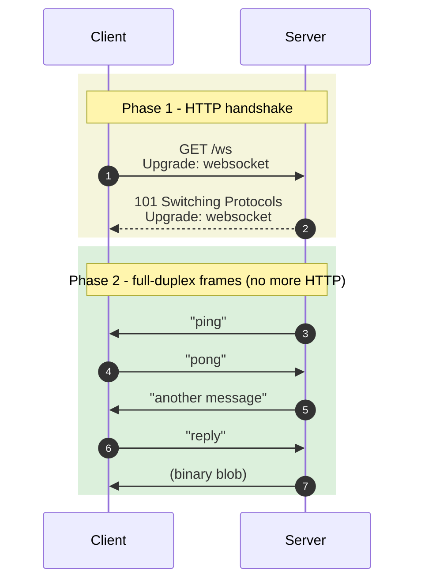

# 5. WebSockets

> **TL;DR:** WebSockets give you a single, persistent, full-duplex TCP connection between client and server. Both sides can send messages at any time, in either text or binary. They start life as an HTTP request that "upgrades" to the WebSocket protocol, then HTTP is out of the picture and it's a custom framed binary channel.

---

## 5.1 What problem do WebSockets solve?

SSE is one-way (server → client). Polling is high-latency and wasteful. Webhooks are server-to-server only.

WebSockets give you the missing piece: **a low-latency, two-way channel between a browser (or any client) and a server**, with very little overhead per message.



After the handshake, there's no concept of "request" and "response" - either side just sends a **frame** whenever it has something to say.

---

## 5.2 The handshake (HTTP → WebSocket)

The connection starts as a normal HTTP request with special headers:

```
GET /chat HTTP/1.1
Host: example.com
Upgrade: websocket
Connection: Upgrade
Sec-WebSocket-Key: dGhlIHNhbXBsZSBub25jZQ==
Sec-WebSocket-Version: 13
```

The server agrees with `101 Switching Protocols`:

```
HTTP/1.1 101 Switching Protocols
Upgrade: websocket
Connection: Upgrade
Sec-WebSocket-Accept: s3pPLMBiTxaQ9kYGzzhZRbK+xOo=
```

From this point on, both sides switch from HTTP framing to **WebSocket frames**. The underlying TCP connection is the same; the protocol on top of it changed.

### Why the upgrade dance?

So WebSocket connections can survive firewalls, proxies, and CDNs that only understand HTTP. Port 80 / 443 is open everywhere; using HTTP-as-the-upgrade-vehicle lets WebSockets piggyback on what's already allowed.

---

## 5.3 Frames

WebSocket messages are sent as **frames**. A frame has:
- An opcode (text? binary? ping? close?)
- A payload length
- A mask key (client→server frames must be masked)
- The payload itself

You almost never think about frames at the application level - your library exposes `send(message)` and `onmessage`. But useful to know:

- **Text frame:** UTF-8 encoded string
- **Binary frame:** arbitrary bytes - image, audio, protobuf
- **Ping/Pong:** heartbeat (handled automatically by libraries usually)
- **Close:** graceful shutdown with a status code

### Frame sizes

A single message can be up to **2^63 bytes** (effectively unlimited). Libraries usually split very large messages into multiple frames automatically.

---

## 5.4 The client side - the WebSocket API

Every modern browser has it:

```javascript
const ws = new WebSocket('wss://example.com/chat');

ws.onopen = () => {
  console.log('connected');
  ws.send('hello');
};

ws.onmessage = (event) => {
  // event.data is a string (text frame) or Blob/ArrayBuffer (binary)
  console.log('received:', event.data);
};

ws.onclose = (event) => {
  console.log('closed, code:', event.code, 'reason:', event.reason);
};

ws.onerror = (err) => {
  console.error('error', err);
};

// Send binary
const buffer = new Uint8Array([0x48, 0x69]);
ws.send(buffer);

// Close
ws.close(1000, "bye");
```

### What WebSocket does NOT give you (you have to build)

- **Auto-reconnect.** Unlike `EventSource`, the WebSocket API does nothing on disconnect. You need a reconnect loop with backoff.
- **Heartbeat.** You need to send pings to detect dead connections; the browser doesn't expose ping frames directly.
- **Resume / replay.** If a client misses messages while offline, the server has to know to send them again (you implement this).
- **Authentication beyond cookies.** Initial handshake supports headers, but the browser API does **not** let you set custom headers (you can pass a subprotocol string as auth, or auth via the URL, or rely on cookies).

### Typical reconnect pattern

```javascript
class ReconnectingWS {
  constructor(url) {
    this.url = url;
    this.backoff = 1000;
    this.connect();
  }
  connect() {
    this.ws = new WebSocket(this.url);
    this.ws.onopen = () => { this.backoff = 1000; this.onopen?.(); };
    this.ws.onmessage = (e) => this.onmessage?.(e);
    this.ws.onclose = () => {
      setTimeout(() => this.connect(), this.backoff);
      this.backoff = Math.min(this.backoff * 2, 30000);  // up to 30s
    };
  }
  send(msg) { this.ws.send(msg); }
}
```

---

## 5.5 The server side - minimal WebSocket (FastAPI)

```python
from fastapi import FastAPI, WebSocket, WebSocketDisconnect

app = FastAPI()

@app.websocket("/ws")
async def ws_handler(websocket: WebSocket):
    await websocket.accept()
    try:
        while True:
            msg = await websocket.receive_text()
            await websocket.send_text(f"echo: {msg}")
    except WebSocketDisconnect:
        print("client disconnected")
```

### Broadcasting to multiple clients

Track connected clients, push to all of them:

```python
clients: set[WebSocket] = set()

@app.websocket("/ws")
async def ws(websocket: WebSocket):
    await websocket.accept()
    clients.add(websocket)
    try:
        while True:
            msg = await websocket.receive_text()
            for c in clients:
                await c.send_text(msg)
    except WebSocketDisconnect:
        clients.discard(websocket)
```

This works for a single server process. Across multiple workers/instances you need **Redis pub-sub** (or NATS, Kafka, etc.) so a message broadcast on server-A reaches clients connected to server-B.

---

## 5.6 Subprotocols

The handshake can negotiate a "subprotocol" - a string that tells both sides what message format to use on top of WebSocket.

```javascript
const ws = new WebSocket('wss://example.com/x', ['mqtt', 'wamp']);
// server picks one of the offered subprotocols
```

This is how protocols like MQTT-over-WebSocket, GraphQL-over-WebSocket, or RPC frameworks like JSON-RPC layer on top of raw WS.

---

## 5.7 Scaling WebSockets

This is where WebSockets get tricky.

**The core constraint:** every connected client consumes one open TCP connection on your server, plus memory for buffers and per-connection state. A single Linux process can hold tens of thousands of open sockets if tuned correctly - but you'll hit limits:

- **File descriptor limits.** `ulimit -n` defaults are often 1024; bump it to 65535 or more.
- **Memory per connection.** Each connection holds buffers; estimate 10-100 KB per idle connection.
- **CPU per message.** Per-frame overhead (header parsing, masking) is small but non-zero.
- **Single process limits.** Node, Python (asyncio), Go all single-process scale to ~10-100K connections in practice.
- **Sticky load balancing.** Once a client connects to server-A, it must keep connecting to server-A for the duration. Use sticky sessions on the LB.
- **Cross-server messaging.** Broadcasting needs a pub-sub like Redis: every server subscribes to the same topic and forwards to its local clients.

### When WebSockets get expensive

100,000 mostly-idle WebSocket connections = ~10-20 GB of RAM, plus you've paid for "always on" infrastructure. If 90% of those clients only need updates every few minutes, **polling or SSE with short-lived connections is cheaper**.

---

## 5.8 Where WebSockets shine in AI apps

- **Voice agents.** Realtime audio in both directions (OpenAI Realtime, ElevenLabs Conversational, Twilio Media Streams). SSE can't do this - you need to **send** audio back.
- **Interactive agent chat with interruption.** User can interrupt a response mid-stream; the client signals "stop" while server is still sending tokens.
- **Collaborative tools with AI.** Multiple users + AI in the same room; everyone sees everyone's edits live (think Cursor, Notion AI, Figma).
- **Multi-agent systems with bidirectional control.** Agent A sends a task to agent B, B replies, A asks follow-ups - all over one persistent channel.
- **MCP "Streamable HTTP" with bidirectional streaming.** Newer MCP transports can use WebSocket-style bidirectional message exchange.

### When NOT to use WebSockets for AI

- **Just streaming LLM output to a user.** Use SSE. Cheaper, simpler, auto-reconnect built in.
- **Triggering an agent from an external event.** Use a webhook.
- **Checking job status on a slow batch.** Use polling.

---

## 5.9 Common pitfalls

- ❌ **No reconnect logic.** Connection drops once on a flaky network → silent client forever.
- ❌ **No heartbeats.** Half-open TCP connections (network died mid-connection) look "open" to your server until you try to write - by then you've lost messages.
- ❌ **No backpressure handling.** Client is slow; your server keeps pushing; you OOM. Use bounded queues.
- ❌ **Custom auth via headers (in browser).** Doesn't work. Use cookies, query string, or first-message auth.
- ❌ **Single-server assumption.** Works in dev with one process. In prod, you need pub-sub for broadcasts.
- ❌ **Sending huge messages.** A 50MB JSON blob over one frame stalls everything. Chunk it.
- ❌ **Treating it like a queue.** WS gives you a transport, not delivery guarantees. If the client is offline when you send, the message is gone (unless you implement queueing).

---

## 5.10 Quick code: send + receive in browser

```javascript
const ws = new WebSocket('wss://your-app.com/chat');

// JSON over WebSocket - extremely common pattern
ws.onopen = () => ws.send(JSON.stringify({ type: 'hello', user: 'alice' }));
ws.onmessage = (e) => {
  const msg = JSON.parse(e.data);
  switch (msg.type) {
    case 'chat':  showChat(msg);   break;
    case 'typing': showTyping(msg); break;
    case 'error': showError(msg);  break;
  }
};

function sendChat(text) {
  ws.send(JSON.stringify({ type: 'chat', text }));
}
```

---

## Mental model

**WebSockets = phone call.**
You dial once. After that, either side can talk anytime. Hang up only when done. The infrastructure cost is real - one open line per caller - but for genuinely interactive use cases nothing else feels as snappy.
