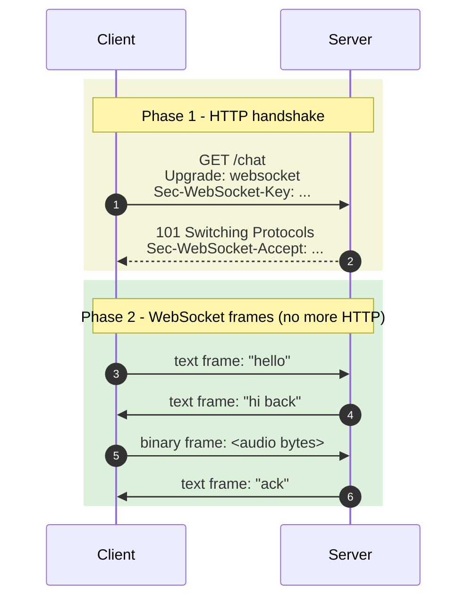

# 5. WebSockets - the phone call

> A persistent, two-way, low-latency channel between client and server. Either side can send messages at any time, in text or binary. The pattern behind chat apps, multiplayer games, voice agents, Figma, and Google Docs.

---

## What you'll learn

- Why WebSockets exist when we already have HTTP, SSE, and webhooks
- The handshake: how a WebSocket connection starts life as HTTP and then transforms
- A complete walkthrough: how Maya builds the driver-customer chat for LiveOrder
- The hard parts: reconnects, heartbeats, scaling across multiple servers, backpressure
- When to choose WebSockets (and the much more common case where SSE is enough)

---

## 5.1 The analogy

You're chatting on the phone with a friend.

- Either of you can talk at any moment.
- There's no "request" or "response" - the conversation just flows.
- Long silences are fine; the line stays open.
- You can transfer anything you can say (or any sound effect or song).
- If you lose signal, the call drops; you have to dial again.
- The phone company keeps the line dedicated to your call.

That is WebSockets. The persistent open line. The full duplex. The flexibility about what you say. And the cost - the phone company keeps a line open even when you're not talking.

---

## 5.2 Why WebSockets exist

We've seen polling (client keeps asking), webhooks (server-to-server callback), and SSE (server pushes one-way to client). What's missing?

A way for a client and a server to talk back and forth, freely, at low latency, with the option of binary data.

Concrete examples where SSE isn't enough:

- **Chat.** Slack, WhatsApp, Telegram - users both send and receive. SSE only handles receive.
- **Voice agents.** Audio chunks fly both ways: the user speaks, the agent speaks back. Sometimes mid-sentence the user interrupts.
- **Multiplayer games.** Each player's inputs need to reach the server and other players' inputs need to reach this player, all within tens of milliseconds.
- **Collaborative editing.** Two cursors moving in the same Google Doc. Each keystroke is a tiny message, and both sides need both directions.
- **Interruptible LLM streams.** The user wants to cancel mid-generation. You need an upstream signal during a downstream stream.

WebSockets solve all of these.

---

## 5.3 The handshake - how the call gets connected

A WebSocket connection starts life as an ordinary HTTP request. The client sends:

```
GET /chat HTTP/1.1
Host: api.liveorder.app
Upgrade: websocket
Connection: Upgrade
Sec-WebSocket-Key: dGhlIHNhbXBsZSBub25jZQ==
Sec-WebSocket-Version: 13
```

The `Upgrade: websocket` header is the magic. It's the client saying "if you support WebSockets, please switch this connection over." The `Sec-WebSocket-Key` is a small handshake nonce used to confirm the server actually understood the protocol (and isn't a cache or proxy faking a 101).

The server agrees:

```
HTTP/1.1 101 Switching Protocols
Upgrade: websocket
Connection: Upgrade
Sec-WebSocket-Accept: s3pPLMBiTxaQ9kYGzzhZRbK+xOo=
```

That's the entire HTTP part. After this point, **HTTP is gone**. The TCP connection is the same one, but now both sides start sending each other **WebSocket frames** instead of HTTP messages.



### Why the upgrade dance?

Because WebSocket can't be a brand-new protocol on a brand-new port without breaking the internet. Ports other than 80 and 443 are blocked by corporate firewalls. Anything that's not HTTP-shaped on those ports often gets dropped or transformed by middleboxes.

By dressing the initial handshake as HTTP, WebSocket sneaks through the same plumbing as web pages. After the upgrade, the bytes look unfamiliar to middleboxes, which is fine - middleboxes have already agreed to "let this connection through."

---

## 5.4 Frames - the unit of WebSocket communication

After the upgrade, both sides exchange **frames**. A frame is the WebSocket equivalent of an HTTP message but much lighter.

Each frame has:

- An **opcode** (text? binary? ping? pong? close?)
- A **payload length** (1 byte to 8 bytes depending on size)
- A **mask key** (client-to-server frames are masked; server-to-client are not)
- The **payload bytes**

You almost never deal with frames at the application level - your library exposes `send(message)` and `onmessage(event)` and handles the framing for you. But it's useful to know:

- **Text frame**: UTF-8 string. Most chat apps use these with JSON inside.
- **Binary frame**: arbitrary bytes. For audio, images, protobuf, etc.
- **Ping / Pong frame**: heartbeat. Libraries usually handle these automatically.
- **Close frame**: graceful shutdown with a status code (1000 = normal, 1006 = abnormal, etc.).

A single message can be up to 2^63 bytes (basically unlimited). Libraries split very large messages into multiple frames automatically. Don't actually do this - send a URL and let the client fetch instead.

---

## 5.5 The client side - the WebSocket API

Every modern browser has it:

```javascript
const ws = new WebSocket('wss://api.liveorder.app/chat');

ws.onopen = () => {
  console.log('connected');
  ws.send(JSON.stringify({ type: 'hello', user: 'raj' }));
};

ws.onmessage = (event) => {
  // event.data is a string for text frames, or Blob/ArrayBuffer for binary
  const msg = JSON.parse(event.data);
  handleMessage(msg);
};

ws.onclose = (event) => {
  console.log('closed; code:', event.code, 'reason:', event.reason);
};

ws.onerror = (err) => {
  console.error('error', err);
};

// Send binary
const buf = new Uint8Array([0x48, 0x69]);
ws.send(buf);

// Close gracefully
ws.close(1000, "bye");
```

That's the entire API. Four event handlers, two methods.

### What `WebSocket` does NOT give you (this is important)

This is where many teams get burned. Unlike `EventSource`, the `WebSocket` API gives you almost nothing for free:

- **No auto-reconnect.** Connection drops → you stay disconnected forever unless you wrote a reconnect loop.
- **No heartbeat.** Idle connections die silently; you find out at the next send attempt.
- **No resume.** If you missed messages while offline, no built-in way to catch up.
- **No backoff.** Naive reconnect-on-error will hammer your server during a partial outage.
- **No custom headers from the browser.** You can use the URL or a subprotocol string for auth tokens, or rely on cookies.

You **will** end up writing a reconnecting WebSocket wrapper. Here's a sketch of the minimum:

```javascript
class ReconnectingWS {
  constructor(url) {
    this.url = url;
    this.backoff = 1000;   // start at 1s
    this.maxBackoff = 30000;
    this.connect();
  }

  connect() {
    this.ws = new WebSocket(this.url);
    this.ws.onopen = () => {
      this.backoff = 1000;        // reset on success
      this.onopen?.();
    };
    this.ws.onmessage = (e) => this.onmessage?.(e);
    this.ws.onclose = () => {
      setTimeout(() => this.connect(), this.backoff + Math.random() * 500);
      this.backoff = Math.min(this.backoff * 2, this.maxBackoff);
    };
    this.ws.onerror = () => this.ws.close();   // trigger onclose path
  }

  send(msg) {
    if (this.ws.readyState === WebSocket.OPEN) this.ws.send(msg);
    else this.queue.push(msg);   // optional: buffer until reconnect
  }
}
```

You'll also want a heartbeat - periodically `ws.send(JSON.stringify({type: 'ping'}))` and have the server respond `{type: 'pong'}`. If you don't see a pong within N seconds, force a reconnect.

---

## 5.6 The server side - a minimal WebSocket endpoint

FastAPI again:

```python
from fastapi import FastAPI, WebSocket, WebSocketDisconnect

app = FastAPI()
clients: set[WebSocket] = set()

@app.websocket("/chat")
async def chat(ws: WebSocket):
    await ws.accept()
    clients.add(ws)
    try:
        while True:
            msg = await ws.receive_text()
            # broadcast to everyone (including the sender)
            for c in list(clients):
                try:
                    await c.send_text(msg)
                except Exception:
                    clients.discard(c)
    except WebSocketDisconnect:
        clients.discard(ws)
```

That works on a single server process for a small number of users. Once you have multiple processes (or multiple machines), you need a pub-sub layer - we'll get to that.

---

## 5.7 Maya builds the driver-customer chat

Back to LiveOrder. When Sam (the driver) is on his way with Raj's biryani, Raj wants to send a quick "I'm in apartment 5C, the buzzer is broken, just call me at 9876543210." Both Sam and Raj need to send AND receive messages.

This is a textbook WebSocket scenario. SSE would only let the server push to one side at a time.

### The connection protocol

Maya designs a JSON message format both sides use:

```javascript
// Client → server
{ "type": "join", "order_id": 123 }
{ "type": "msg", "text": "I'm in 5C" }
{ "type": "typing", "is_typing": true }

// Server → client
{ "type": "msg", "from": "raj", "text": "I'm in 5C", "ts": 1700000000 }
{ "type": "typing", "from": "raj", "is_typing": true }
{ "type": "presence", "user": "sam", "online": true }
{ "type": "history", "messages": [...] }   // sent on initial join
```

This little envelope-and-type pattern is the most common WebSocket convention in the wild. Each message includes a `type` so the receiver can dispatch.

### The server

```python
import asyncio, json
from fastapi import FastAPI, WebSocket, WebSocketDisconnect

app = FastAPI()

# In production this would be a Redis pub/sub channel per order_id.
# For now, an in-process registry.
rooms: dict[int, set[WebSocket]] = {}

async def broadcast(order_id: int, msg: dict, exclude: WebSocket | None = None):
    payload = json.dumps(msg)
    for ws in list(rooms.get(order_id, set())):
        if ws is exclude:
            continue
        try:
            await ws.send_text(payload)
        except Exception:
            rooms[order_id].discard(ws)

@app.websocket("/chat")
async def chat(ws: WebSocket):
    await ws.accept()

    # Auth via subprotocol or cookie. Simplified:
    user = ws.query_params.get("user")
    order_id = None

    try:
        while True:
            raw = await ws.receive_text()
            msg = json.loads(raw)

            if msg["type"] == "join":
                order_id = msg["order_id"]
                rooms.setdefault(order_id, set()).add(ws)
                # Send chat history
                history = await db.get_chat_messages(order_id, limit=50)
                await ws.send_text(json.dumps({"type": "history", "messages": history}))
                await broadcast(order_id, {"type": "presence", "user": user, "online": True}, exclude=ws)

            elif msg["type"] == "msg":
                stored = await db.store_message(order_id, user, msg["text"])
                await broadcast(order_id, {"type": "msg", "from": user, "text": msg["text"], "ts": stored.ts})

            elif msg["type"] == "typing":
                await broadcast(order_id, {"type": "typing", "from": user, "is_typing": msg["is_typing"]}, exclude=ws)

    except WebSocketDisconnect:
        if order_id is not None:
            rooms[order_id].discard(ws)
            await broadcast(order_id, {"type": "presence", "user": user, "online": False})
```

### The client

```javascript
const ws = new ReconnectingWS(`wss://api.liveorder.app/chat?user=raj`);

ws.onopen = () => ws.send(JSON.stringify({ type: 'join', order_id: 123 }));

ws.onmessage = (e) => {
  const m = JSON.parse(e.data);
  switch (m.type) {
    case 'history': renderHistory(m.messages); break;
    case 'msg':     appendMessage(m); break;
    case 'typing':  showTypingIndicator(m); break;
    case 'presence':updatePresence(m); break;
  }
};

function sendMessage(text) {
  ws.send(JSON.stringify({ type: 'msg', text }));
}

let typingTimer;
inputBox.addEventListener('input', () => {
  ws.send(JSON.stringify({ type: 'typing', is_typing: true }));
  clearTimeout(typingTimer);
  typingTimer = setTimeout(() => {
    ws.send(JSON.stringify({ type: 'typing', is_typing: false }));
  }, 1000);
});
```

That's a respectable chat feature in about 60 lines of code. Real chat apps add: message reactions, read receipts, file attachments, push notifications when offline, end-to-end encryption. The plumbing stays the same shape.

---

## 5.8 Scaling - the hard part

A single-process server works for a few thousand WebSockets. Past that, things get interesting.

### The capacity story

- A modern Linux server can hold **tens of thousands** of idle TCP connections per process, given:
  - File descriptor limits raised (`ulimit -n 65535` and `/etc/security/limits.conf`).
  - Enough RAM. Roughly **50-100 KB per idle connection** including kernel buffers, your framework's state, and your per-user objects.
  - An async runtime. Sync-per-request frameworks (classic Flask, Django before Channels) tap out at hundreds of connections because each holds a thread.
- **100K idle WebSockets ≈ 10 GB RAM** on a tuned server. **1M ≈ specialised infrastructure** (Phoenix Channels, Centrifugo, Ably, dedicated edge nodes).

These are rough numbers. Your actual capacity depends on per-message volume, message size, what your handler does between messages, GC pressure, and so on. But the order of magnitude is correct.

### Sticky load balancing

Once a client establishes a WebSocket with server-A, it must keep talking to server-A for the duration. The load balancer can't shift the existing connection to server-B.

This means: enable **sticky sessions** (also called session affinity) on your load balancer, usually based on the client IP or a cookie. Otherwise the initial HTTP handshake might land on server-A but subsequent reconnects might land on server-B with no memory of the user.

### Cross-server messaging

If Sam connects to server-A and Raj connects to server-B, how does a message from Raj reach Sam?

**Answer**: a pub-sub backbone. Every server subscribes to the same Redis (or NATS, or Kafka) channel. When Raj sends a message:

1. Server-B receives it.
2. Server-B publishes it to Redis channel `chat:order:123`.
3. Both server-A and server-B (and all other servers) receive the published message.
4. Each server checks its local in-memory `rooms` dict for clients of order 123 and forwards the message.

Add this to Maya's broadcast function:

```python
import aioredis

redis = aioredis.from_url("redis://localhost")

async def broadcast(order_id: int, msg: dict, exclude=None):
    # 1. Local clients (same as before)
    payload = json.dumps(msg)
    for ws in list(rooms.get(order_id, set())):
        if ws is exclude: continue
        try: await ws.send_text(payload)
        except: rooms[order_id].discard(ws)

    # 2. Cross-server clients
    await redis.publish(f"chat:order:{order_id}", payload)

async def subscribe_to_cross_server():
    pubsub = redis.pubsub()
    await pubsub.psubscribe("chat:order:*")
    async for message in pubsub.listen():
        if message["type"] != "pmessage": continue
        order_id = int(message["channel"].split(":")[-1])
        # Local fanout (skip republishing!)
        payload = message["data"]
        for ws in list(rooms.get(order_id, set())):
            try: await ws.send_text(payload)
            except: rooms[order_id].discard(ws)
```

This is the standard pattern. Once you have it, you can scale to as many backend servers as you like.

### Backpressure

If a client is slow (bad network, big messages buffered), your server's `send` queue grows. Without limits, slow clients can drive your server out of memory.

Mitigation:

```python
import asyncio

async def safe_send(ws: WebSocket, msg: str):
    try:
        await asyncio.wait_for(ws.send_text(msg), timeout=2.0)
    except asyncio.TimeoutError:
        await ws.close(1011, "slow consumer")
        rooms[order_id].discard(ws)
```

Or use bounded queues per client. Either way: **decide what to do with slow clients before they decide for you (by OOMing your server).**

---

## 5.9 Subprotocols - the negotiation trick

The handshake can negotiate a subprotocol - a string that tells both sides what message format to use on top of WebSocket.

```javascript
const ws = new WebSocket('wss://api.liveorder.app/chat', ['liveorder.v1', 'liveorder.v0']);
```

The client offers a list of subprotocols. The server picks one it understands and sends it back in `Sec-WebSocket-Protocol`. Both sides now know which version of the message format to use.

A common abuse: passing auth tokens via the subprotocol string, because the browser API doesn't let you set headers. Works, but token leakage to logs is possible. Cookie auth or a short-lived URL token is usually cleaner.

---

## 5.10 Common bugs and how to debug them

### "Connection drops after 60 seconds with no activity"

Idle-connection killer. Same as SSE. Add a heartbeat ping/pong every 20-30 seconds.

### "Client reconnects in a tight loop and overwhelms the server"

You forgot exponential backoff. The naive "reconnect immediately on close" pattern means a brief server outage causes thousands of clients to reconnect simultaneously when the server comes back up, often crashing it again. Always backoff with jitter.

### "Messages arrive out of order"

WebSocket guarantees in-order delivery on a single connection. If you're seeing out-of-order messages, the issue is upstream (you have multiple workers handling broadcasts and they race) or the client has multiple parallel WebSockets to the same endpoint.

### "Auth works for the handshake but I can't get the user identity inside the message loop"

Auth happens during the upgrade. Save it on the `WebSocket` object (or pass it in a context dict) so message handlers can see it. Don't re-validate the token on every message - it doesn't change.

### "Browser console shows 'WebSocket connection failed'"

Common causes:

- Server returned a non-101 status. Likely you have a middleware that returns 404 or 401 before the upgrade. Check server logs.
- You're using `ws://` from an `https://` page. Mixed content; use `wss://`.
- Proxy in the way that doesn't handle Upgrade headers. (Common with old corporate proxies.)
- Wrong path. (Maya once spent 2 hours debugging `/api/chat` vs `/api/ws/chat`.)

### "Works on dev, dies in prod"

Almost always: load balancer not configured for WebSockets. Confirm sticky sessions, increased idle timeouts (5+ minutes), and that the LB actually understands the Upgrade header. AWS ALB needs explicit support, GCP Load Balancer ditto, Cloudflare requires the right plan tier.

---

## 5.11 Real-world appearances

- **Slack / Discord**: chat, presence, typing indicators.
- **WhatsApp Web**: messages, read receipts, typing.
- **Figma / Excalidraw / Miro**: live multi-cursor collaboration.
- **Google Docs**: every keystroke from every user.
- **Multiplayer browser games**: agar.io, slither.io, krunker.io.
- **OpenAI Realtime API**: bidirectional audio for voice agents.
- **Cursor / GitHub Copilot Chat**: bidirectional agent conversation.
- **Trading platforms**: live order book updates and order submissions.
- **Liveops dashboards**: any time you see "Connected" in green, it's probably a WebSocket.

If you ever wondered "how does this app feel so live?", the answer 80% of the time is WebSocket plus a pub-sub backbone.

---

## 5.12 When NOT to use WebSockets

This is more important than when to use them, because the default mistake is to over-reach.

- **You only need updates from server to client.** Use SSE. It's cheaper, simpler, has auto-reconnect for free, and works through more proxies.
- **Updates are rare.** Use polling.
- **The trigger is an external service.** Use webhooks.
- **You're on a serverless platform with no WebSocket support.** AWS Lambda doesn't do WebSockets natively; you can route through API Gateway WebSocket but it's expensive at scale. Consider managed services (Ably, Pusher, Soketi).
- **You need delivery guarantees.** WebSockets are best-effort. If the connection drops mid-send, the message may not arrive. For at-least-once delivery, you need an application-level acknowledgement and replay protocol on top.

---

## 5.13 Cheat sheet

- **WebSocket** = full-duplex persistent connection, starts as HTTP, upgrades to a frame-based protocol.
- **Two-way, text or binary, low overhead per message.**
- **Browser API**: `new WebSocket(url)`. Four event handlers, two methods. Auto-reconnect, heartbeat, and resume are NOT included.
- **Server side**: needs async I/O. One held connection per client.
- **Scaling**: tens of thousands per process easy, 100K+ needs tuning, 1M+ needs specialised infrastructure. Always need sticky sessions and (past one process) a pub-sub backbone.
- **Use for**: chat, voice, games, collaboration, interruptible LLM streams.
- **Avoid for**: one-way streaming (SSE), external triggers (webhooks), rare polls (polling).

---

## Mental model recap

**WebSocket = open phone line, both sides can talk anytime.** It's the most powerful real-time pattern and the most expensive. The default mistake is to reach for it when SSE would do; the second mistake is to forget that "open the connection" is only 5% of the work and "keep it reliable at scale" is the other 95%.

Next page: a single sheet you can keep on your desk. The decision tree, the cost rankings, the side-by-side table, and a list of "I'm building X, what should I use?" answers for the most common AI and web scenarios.
