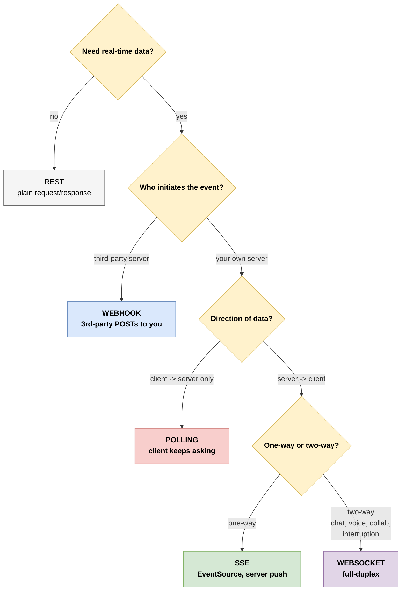

# 6. The Decision Matrix - Which Pattern When?

> **TL;DR:** Most developers reach for the wrong pattern by default. WebSockets are sexy; polling is "boring"; webhooks are "scary." This page is the cheat sheet to pick the right one.

---

## 6.1 The four questions to ask

When facing a real-time-ish requirement, walk through these in order:

```mermaid
flowchart TD
    Q1["Q1: Who initiates the communication?"]
    Q1 --> Q1A["Client only -> POLLING"]
    Q1 --> Q1B["Server only -> WEBHOOK (server-to-server)<br/>or SSE (server-to-client)"]
    Q1 --> Q1C["Both -> WEBSOCKET"]

    Q2["Q2: What direction does data flow?"]
    Q2 --> Q2A["Client to server only -> REST"]
    Q2 --> Q2B["Server to client only -> SSE"]
    Q2 --> Q2C["Server to server only -> WEBHOOK"]
    Q2 --> Q2D["Both directions -> WEBSOCKET"]

    Q3["Q3: How often?"]
    Q3 --> Q3A["Rare, latency-tolerant -> POLLING / WEBHOOK"]
    Q3 --> Q3B["Frequent, low latency -> SSE / WEBSOCKET"]

    Q4["Q4: How many concurrent clients?"]
    Q4 --> Q4A["under 1000 - anything works"]
    Q4 --> Q4B["1k-10k - SSE or efficient polling"]
    Q4 --> Q4C["over 10k - pub-sub layer required"]

    classDef q fill:#fff2cc,stroke:#d6b656,color:#000,font-weight:bold
    class Q1,Q2,Q3,Q4 q
```

---

## 6.2 The big table

| Aspect | Polling (short) | Polling (long) | Webhooks | SSE | WebSocket |
|--------|-----------------|----------------|----------|-----|-----------|
| **Direction** | C→S only | C→S only | S→S only | S→C only | Both ways |
| **Latency** | Half the interval | Near-instant | Near-instant | Near-instant | Near-instant |
| **Server cost when idle** | Per-poll cost | One held conn per client | Zero | One conn per client | One conn per client |
| **Setup complexity** | Trivial | Moderate | Moderate (need public URL) | Easy | Moderate |
| **Auto-reconnect** | N/A | Manual | Sender retries | Built in (browser) | Manual |
| **Works behind corp proxies** | Always | Almost always | N/A (server-side) | Almost always | Sometimes blocked |
| **Binary support** | N/A | N/A | Yes (any payload) | No (text only) | Yes |
| **Browser API** | `fetch` | `fetch` | N/A (server) | `EventSource` | `WebSocket` |
| **Auth in browser** | Headers fine | Headers fine | HMAC signatures | Cookies only* | Cookies / URL token |
| **Scaling tooling** | Plain LB | Need async I/O | Plain LB | Pub-sub + sticky | Pub-sub + sticky |
| **Order guarantee** | Per-request | Per-request | Per-event (sender-dependent) | Yes (in stream) | Yes (in stream) |
| **Delivery guarantee** | Best-effort | Best-effort | At-least-once (with retries) | Best-effort | Best-effort |

*Custom headers not allowed on EventSource constructor in browsers. Use cookies or URL params.

---

## 6.3 Decision tree

---

## 6.4 By use case

| Use case | Pattern | Why |
|----------|---------|-----|
| ChatGPT-style token streaming | **SSE** | One-way, browser-native, auto-reconnect, simple |
| Slack-style chat | **WebSocket** | Bidirectional, low latency, typing indicators |
| Stock ticker dashboard | **SSE** | One-way, many subscribers, no client→server traffic |
| Multiplayer game | **WebSocket** | Low latency, bidirectional, binary |
| Voice agent (audio in + out) | **WebSocket** | Bidirectional binary, low latency |
| Stripe payment notification | **Webhook** | Stripe is the source; pings your backend |
| GitHub Action triggered by PR | **Webhook** | Push from GitHub to your CI |
| Status of a slow background job | **Polling** (or SSE) | Simple, low-frequency, fits REST |
| File upload progress (within one request) | **(not these patterns)** | Browser fetch streaming + `progress` event |
| LLM agent calling a long-running tool | **SSE** from tool back | Stream progress events |
| Live collaborative editor | **WebSocket** | Bidirectional, sub-100ms ideal |
| Push notification to mobile app | **(none of these)** | APNs / FCM - different infrastructure |
| Email delivery confirmation | **Webhook** | SES / SendGrid notify you |
| Cron-like check every minute | **Polling** | No event source; you ask |

---

## 6.5 Cost mental model

A rough cost ranking, from cheapest infra to most expensive **per client**:

1. **Webhooks** - zero cost between events. Server only does work when events fire.
2. **Short polling** - N requests/min per client, but each is cheap and stateless. Scales horizontally trivially.
3. **Long polling** - Held connections cost memory but no CPU until data arrives.
4. **SSE** - One held connection per client, plus push cost when events fire.
5. **WebSockets** - Same as SSE, plus more frame overhead and bidirectional buffer state.

**Rule of thumb:** if you can model a feature as "rare events" rather than "persistent connection," use the rare-event tool.

---

## 6.6 Hybrid patterns are normal

Real apps combine these:

- **App startup:** REST call to fetch initial state.
- **Live updates:** SSE or WebSocket pushes deltas.
- **Mutations:** REST POST for actions.
- **External integrations:** webhooks receive events from third parties.
- **Long jobs:** polling on `/jobs/{id}/status` as the simple fallback.

You don't pick one. You pick the right one **per feature**.

---

## 6.7 Anti-patterns to avoid

- ❌ **WebSockets just because.** "We want real-time updates" → SSE is probably enough.
- ❌ **Polling every 100ms.** You've reinvented streaming with extra steps.
- ❌ **Webhooks without retry/idempotency.** You'll lose events silently.
- ❌ **SSE for client→server input.** It's one-way. Use REST POST alongside for input.
- ❌ **Long-lived connections in a synchronous framework.** You'll exhaust the worker pool. Use asyncio / Node / Go.
- ❌ **One pattern for everything.** Different features have different needs.

---

## 6.8 What changes at scale

| Scale | What to watch |
|-------|--------------|
| Dozens of clients | Anything works. Pick by ergonomics. |
| Hundreds | Make sure long-held connections use async I/O. Set keep-alive timeouts. |
| Thousands | Need a pub-sub backbone (Redis/NATS) for broadcasts across server processes. Sticky LB for WS. |
| Tens of thousands | Dedicated connection-handling tier (separate from app servers). Tune kernel (`somaxconn`, file descriptors). |
| Hundreds of thousands | Specialized services (Phoenix Channels, Centrifugo, Ably, Pusher, Soketi). |

---

## Mental model

**Right tool, right job.**
- *Periodic check?* → Polling.
- *One-time push from outside?* → Webhook.
- *Server-to-client live updates?* → SSE.
- *Both sides talking?* → WebSocket.

Don't over-engineer. Don't under-engineer. Pick the simplest pattern that meets the latency and direction needs of **this** feature.
