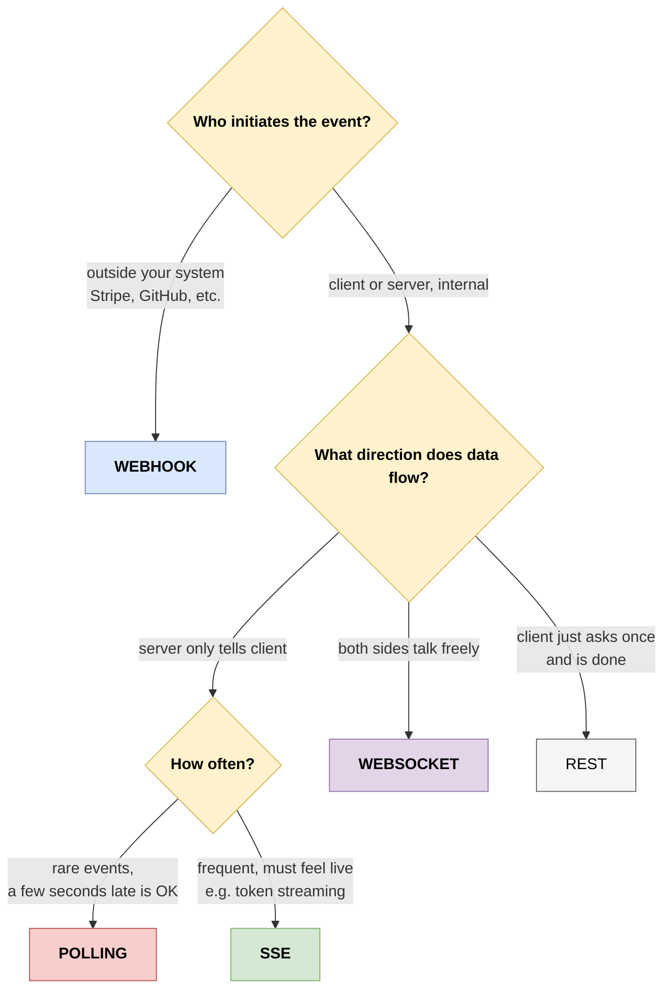

# 6. The Decision Matrix - Which Pattern When?

> A reference page you can keep open during design meetings. Walks you from "I have a feature to build" to "use this pattern" in under a minute, then explains *why*.

---

## What's on this page

- A four-question decision tree
- A side-by-side feature table
- "I'm building X" recipes for 15 common scenarios
- Cost rankings (in money and in human-hours)
- Common antipatterns to avoid
- What changes at scale

---

## 6.1 The four questions

When someone says "I need real-time," ask these in order. The first one that gives you a clear answer is your answer.

Some examples through the tree:

- **Stripe payment confirmed.** Outside your system. → Webhook.
- **Chat between two users.** Both talk. → WebSocket.
- **LLM streaming an answer.** Server tells client, frequent, must feel live. → SSE.
- **"Is my batch job done?"** Server tells client, rare, OK to be late. → Polling.

---

## 6.2 The full feature table

| Aspect | Polling (short) | Polling (long) | Webhooks | SSE | WebSocket |
|--------|-----------------|----------------|----------|-----|-----------|
| **Direction** | Client → Server | Client → Server | Server → Server | Server → Client | Both |
| **Who initiates** | Client | Client | External server | Client (then server pushes) | Client (then both) |
| **Latency** | Half the interval | Near-instant | Near-instant | Near-instant | Near-instant |
| **Server cost when idle** | Per-poll cost | One held connection | Zero | One connection | One connection |
| **Setup complexity** | Trivial | Easy | Medium (need public URL, signing) | Easy | Medium (reconnect, heartbeats) |
| **Auto-reconnect** | N/A (next poll) | Manual | Sender retries | Built in (browser) | Manual |
| **Works through corporate proxies** | Always | Almost always | N/A (server-side) | Almost always | Sometimes blocked |
| **Binary support** | No (base64 in JSON) | No | Yes (any payload) | No (text only) | Yes |
| **Browser API** | `fetch` | `fetch` | N/A (server-side) | `EventSource` | `WebSocket` |
| **Auth in browser** | Headers fine | Headers fine | HMAC signatures | Cookies only (mostly) | Cookies / URL / subprotocol |
| **Scaling tooling** | Plain load balancer | Need async I/O | Plain LB | Pub-sub + sticky | Pub-sub + sticky |
| **Order guarantee** | Per request | Per request | Per event (sender-dependent) | Yes (within stream) | Yes (within connection) |
| **Delivery guarantee** | Best-effort | Best-effort | At-least-once (with retries) | Best-effort | Best-effort |
| **Resume after disconnect** | Trivial (cursor) | Trivial (cursor) | Sender retries | `Last-Event-ID` (built in) | DIY |
| **Time to ship first version** | 1 hour | 4 hours | 1 day | 2 hours | 1-2 days |
| **Time to make it production-grade** | 1 day | 3 days | 1 week | 1-2 days | 1-2 weeks |

---

## 6.3 "I'm building X. What should I use?" - 15 recipes

### Scenario 1: ChatGPT-style typewriter response

**Use SSE.** One-way, browser-native, auto-reconnect for free, resumable, scales well. This is what OpenAI and Anthropic actually do.

### Scenario 2: Slack-style team chat

**Use WebSocket.** You need both directions (typing indicators, message send + receive, presence updates) and low latency.

### Scenario 3: Stripe payment notification to your backend

**Webhook.** Stripe is the source of truth; let them call you. The alternative (polling Stripe's API) would burn your rate limit and add 5-30 second delays.

### Scenario 4: Live deploy logs (Vercel-style)

**SSE.** The server has the log stream; the client just watches.

### Scenario 5: Multiplayer browser game

**WebSocket.** Sub-100 ms two-way latency, sometimes binary frames, definitely both directions.

### Scenario 6: Voice agent (audio in + audio out)

**WebSocket.** Binary frames in both directions. SSE can't carry binary cleanly. Polling can't keep up. Webhooks don't apply.

### Scenario 7: Notify your backend when a GitHub PR is opened

**Webhook.** GitHub fires events to your URL. Don't poll GitHub - you'll hit rate limits and miss events.

### Scenario 8: "Is my long batch job done yet?" status page

**Polling.** Updates every few minutes, simple, OK to be a bit late, no need for streaming.

### Scenario 9: Real-time stock ticker for a dashboard

**SSE.** Server-to-client only, many subscribers, no client interaction. WebSocket would also work but is overkill.

### Scenario 10: Collaborative document editing (Google Docs style)

**WebSocket.** Each keystroke from each user has to reach every other user. Needs both directions, low latency, and ideally support for offline-then-sync (which is a whole CRDT topic).

### Scenario 11: An MCP server you're building

**SSE / Streamable HTTP.** That's the MCP spec. Tool calls produce many progress events; clients want them as they happen. SSE's "one request, many response events" shape fits perfectly.

### Scenario 12: Push notifications to a mobile app while the app is closed

**None of the above.** Use Apple Push Notification Service (APNs) or Firebase Cloud Messaging (FCM). These are platform-specific services that route through the OS even when your app isn't running.

### Scenario 13: File upload progress within one HTTP request

**None of the above.** Use browser fetch streaming + `progress` event, or XHR `progress`. Both fire as the request body is being sent. This is request-progress, not a separate channel.

### Scenario 14: Triggering a downstream service when an internal event happens (your inventory system tells your analytics system)

**Webhook.** Same pattern, just internal. Sign the payloads anyway; service mesh tokens or HMAC.

### Scenario 15: Live cursor positions in Figma-like collaboration

**WebSocket.** Hundreds of position updates per second per user, two-way, presence tracking, the works. Plus a pub-sub backbone like Redis or NATS to fan out between server instances.

---

## 6.4 Cost ranking

Rough cost per client, from cheapest to most expensive:

1. **Webhook receiver.** Zero idle cost. Server only does work when events fire. Scales for free when nothing's happening.
2. **Short polling.** N requests per minute per client. Each request is cheap and stateless. Scales horizontally trivially. Cost grows linearly with `clients × poll_rate`.
3. **Long polling.** One held connection per client, but no CPU until data arrives. Memory cost roughly equal to SSE.
4. **SSE.** One held connection per client. Push cost when events fire. Heartbeat overhead is tiny (one tiny write per ~20 seconds).
5. **WebSocket.** Same as SSE plus more state per connection (framing buffers, send queues, application-level reconnect/heartbeat state). Pub-sub fan-out cost in multi-server deployments.

Engineering cost (time to ship, time to maintain) usually outweighs runtime cost at small scale, so the order also matters:

- **Polling**: hours to ship, hours to operate.
- **Webhook receiver**: a day to ship, days to keep robust (sig verification, dedup, retries handling).
- **SSE**: a day or two to ship, similar to operate.
- **WebSocket**: a week or two to ship a polished version, ongoing effort for reconnects/scaling.

---

## 6.5 What changes at scale

Engineering decisions are different at 10 users vs 10K vs 1M.

### Up to ~100 concurrent users

Anything works. Pick by ergonomics. Run on a single server.

### 100 to ~10,000 concurrent

- Make sure long-lived connections use async I/O.
- Set kernel `ulimit -n` to a high value (65535+).
- Add a heartbeat for SSE / WebSocket.
- Add an idle timeout on the LB (typically 60-300 seconds).
- Monitor connection counts, not just request counts.

### 10K to ~100K concurrent

- Multiple backend processes/instances.
- Pub-sub backbone (Redis, NATS, Kafka) for cross-server message fan-out.
- Sticky sessions on the load balancer for WebSocket / SSE.
- Consider connection-handling tier separated from app servers (a "gateway" tier that holds connections and forwards to a stateless app tier).
- Detailed connection metrics: open count, churn rate, message throughput, slow consumers.

### 100K to ~1M concurrent

- Move to specialised tools: Phoenix Channels (Elixir), Centrifugo, NATS, dedicated WebSocket platforms (Ably, Pusher, Soketi, PartyKit).
- Kernel tuning: TCP buffer sizes, file descriptors, sysctl knobs.
- Edge-based delivery (Cloudflare Workers WebSockets, Fastly Compute).
- Real ops team / on-call dedicated to the connection layer.

### Over 1M concurrent

You're past the territory of "another good blog post" and into "specialised infrastructure built by teams who think about this all day." Hire someone who's done it before.

---

## 6.6 Common antipatterns

### "We need real-time, so let's use WebSockets"

Reflexive WebSocket. Often the use case is one-way (server pushes to UI), in which case SSE is half the code and twice as robust. Audit your actual data flow before picking.

### "Polling every 100ms"

You've reinvented streaming, but worse. Switch to SSE and you'll cut your CPU bill in half while improving latency.

### "Webhook receiver does the work inline"

Sender times out at 10 seconds; your DB write took 12; sender retries; your idempotency wasn't there; you process the same payment twice. Always queue work; return 200 fast.

### "WebSocket without backoff"

A 30-second outage means the moment the server is back up, 10,000 clients reconnect simultaneously and crash it again. Always backoff + jitter.

### "Long polling on a sync server"

Your worker pool fills up at 50 concurrent users and the whole service grinds. Long polling needs `async`, full stop.

### "Building auth into the SSE/WebSocket URL"

Tokens in URLs end up in access logs, proxy logs, browser history. Use cookies, or short-lived tokens that expire in minutes, or a token exchange (HTTP POST returns a short-lived ticket the client then passes to the WS URL).

### "No heartbeats"

After 5 minutes of silence, the connection is dead, you just don't know yet. First message fails. Always heartbeat - every 15-30 seconds.

### "Caching SSE responses"

A CDN sees a long-lived response and caches the partial body. Subsequent clients get the cached partial. Set `Cache-Control: no-store` on streaming endpoints.

---

## 6.7 Hybrid patterns are normal

Real apps almost never use just one. A common composition for a chat app:

- **HTTP REST**: load user profile, fetch chat history on first open.
- **SSE**: receive new messages, presence updates, typing indicators (if one-way).
- **WebSocket**: instead of SSE, if you want typing indicators to flow upward too.
- **Webhook**: receive Stripe billing events for premium accounts.
- **Polling**: a fallback for "are we connected" if WS handshake fails for some users.

You don't pick one for the whole app. You pick the right one per feature.

---

## 6.8 Cheat sheet on a single line

> **Default to SSE. Reach for WebSocket only when you genuinely need bidirectional or binary. Use polling for slow, rare checks. Use webhooks when something OUTSIDE your system is the source of truth.**

If you remember nothing else, that's it. Print it on a sticky note.

---

Next page: the chapter that ties everything together. Where these four patterns show up in modern AI applications - agents, MCP servers, voice assistants, long-running tasks - and which to pick when you're building each.
