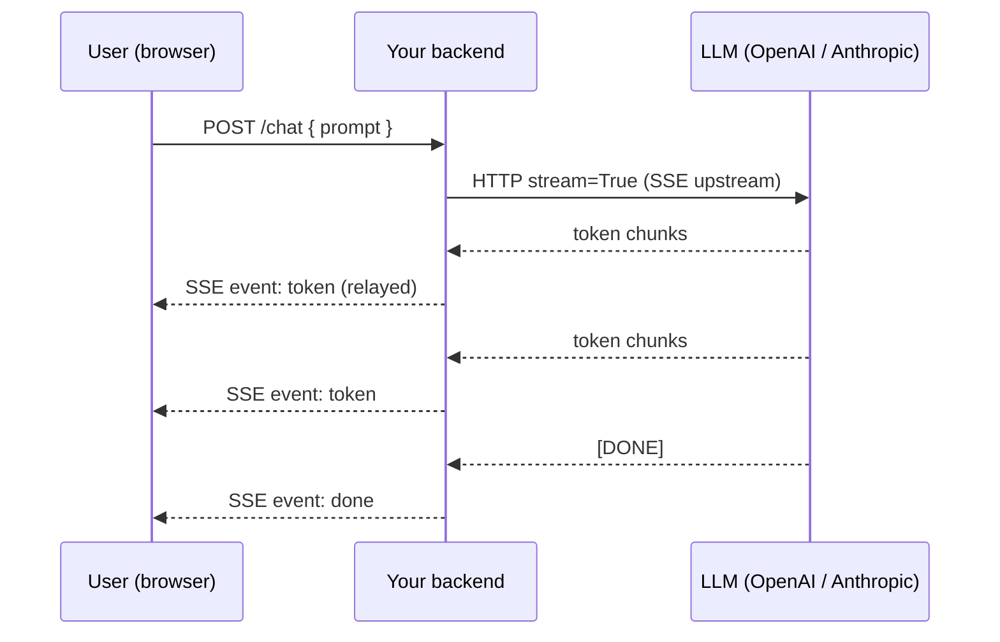
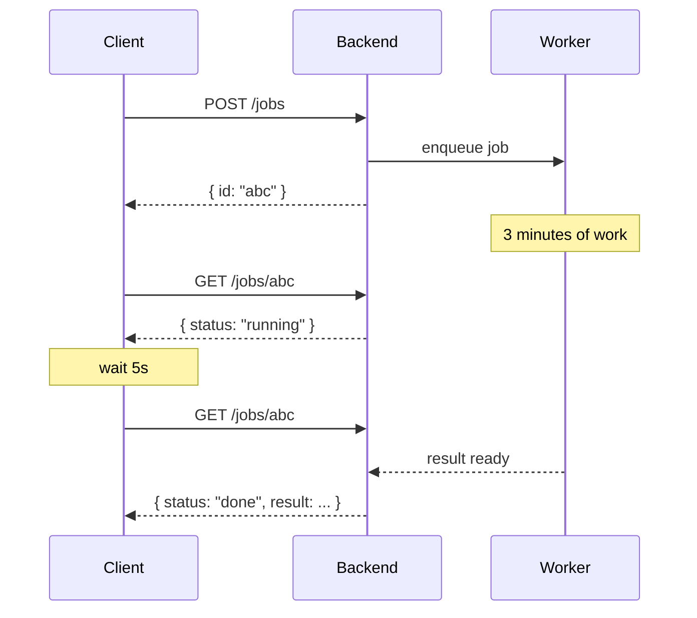
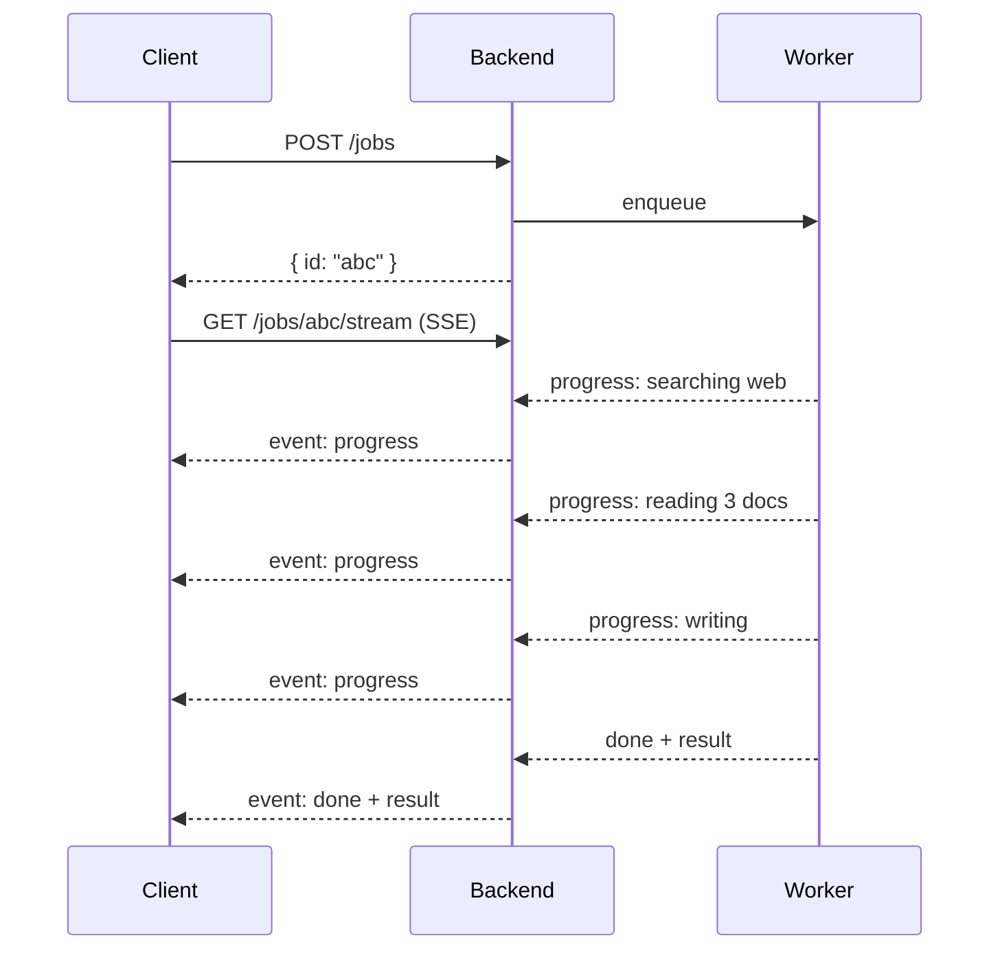
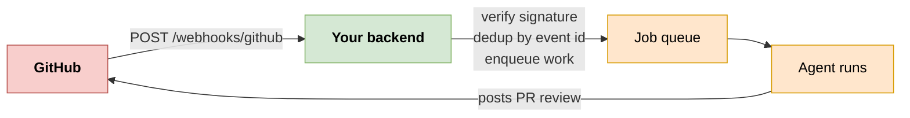
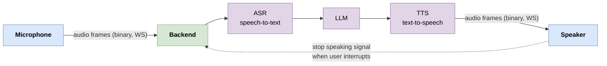
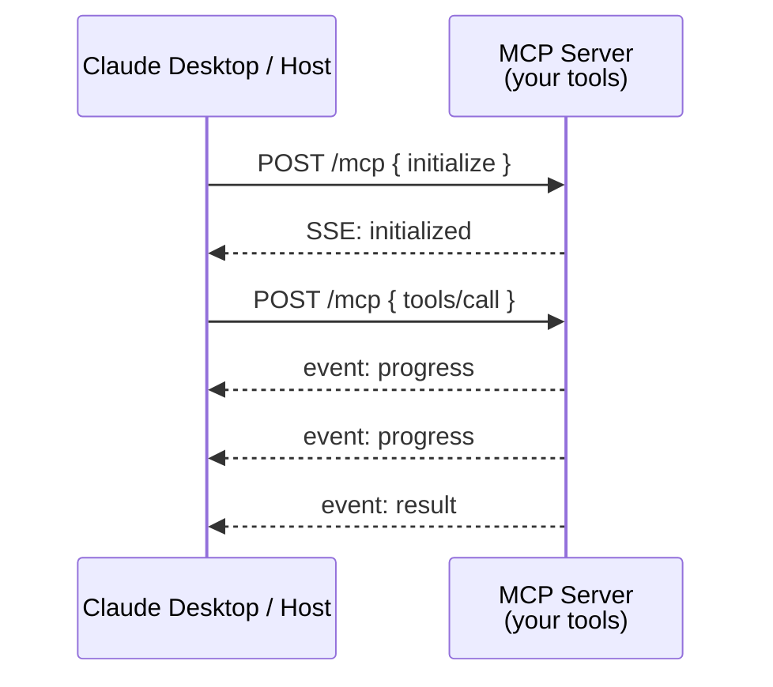
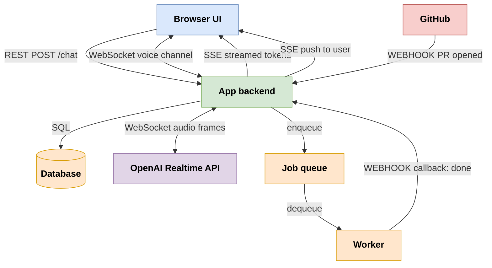

# 7. Real-Time Patterns in AI Agents, MCP, and LLM Apps

> **TL;DR:** These four patterns are the hidden plumbing of every AI app. Pick wrong and your agent feels laggy, expensive, or unreliable. This page maps each pattern to where it actually shows up in modern AI architectures.

---

## 7.1 Why this section exists

You can build a "real-time" feature without ever picking the right protocol, and it'll mostly work - until it doesn't. AI apps make these choices harder because:

- **LLM output is naturally streamed.** Static REST feels broken after you've seen streaming.
- **Tools can take seconds to minutes.** Agent UX hangs on what you do during that wait.
- **External services (GitHub, Slack, Stripe) trigger agent work.** That's webhooks.
- **Voice and collaborative interfaces need bidirectional channels.** That's WebSockets.
- **MCP itself is built on these patterns.** If you build MCP tools or hosts, you're working with SSE and Streamable HTTP.

---

## 7.2 The five canonical scenarios

### Scenario 1: Streaming an LLM reply to a user

**The use case.** User sends a chat message. The LLM begins generating tokens. You want each token to appear in the UI as soon as it's produced, not all at once at the end.

**The right pattern.** **SSE.**

**Why.** The data only flows one way (server → client). The user clicks "send" via a normal REST POST. The reply streams back as an SSE event stream. Browser's `EventSource` handles reconnect for free.

**Architecture sketch.**

**Why not WebSocket?** Adds complexity (handshake, framing) for no benefit if the user doesn't need to interrupt mid-stream.

**Why not polling?** Latency is wrong by orders of magnitude.

---

### Scenario 2: Agent kicks off a long-running task

**The use case.** User asks the agent to "research the top 10 EV manufacturers and write a report." The agent dispatches a job that takes 3-5 minutes. The UI needs to know when it's done - and ideally show progress along the way.

**Right patterns:** **Polling** (simple), **SSE** (better UX), or **Webhook callback** (if the dispatch is to an external system).

**Option A - Polling (simplest):**

**Option B - SSE for progress:**

**Option C - Webhook callback (when the worker is external):**
You hand the worker a `callback_url`. When done, the worker POSTs to it.

---

### Scenario 3: External event triggers agent

**The use case.** GitHub fires "PR opened" → agent reviews the code. Stripe fires "payment.succeeded" → agent triggers fulfillment. Slack fires "message in #support" → agent drafts a reply.

**The right pattern.** **Webhook.**

**Why.** You're not initiating; the external service is. They need a public URL to POST to.

**Architecture sketch.**

**The critical bits:**
- Verify the signature on every payload (otherwise anyone can fake a "PR opened" event)
- Respond 200 fast - do the agent work asynchronously
- Dedup by event ID (GitHub will sometimes redeliver)

---

### Scenario 4: Voice or interactive bidirectional agent

**The use case.** A voice agent that listens and speaks. Or a chat agent where the user can interrupt mid-response. Or a multi-agent system where agents talk to each other continuously.

**The right pattern.** **WebSocket.**

**Why.** You need both directions, low latency, and (for voice) binary frames for audio.

**Architecture sketch (voice):**

This is what OpenAI's Realtime API, ElevenLabs Conversational AI, and most voice agents use under the hood.

---

### Scenario 5: MCP - Model Context Protocol

**The use case.** Claude (or another LLM host) wants to call tools defined by an MCP server. The host launches the server, calls tools, receives results, and the server can push events (tool progress, prompts, notifications).

**The patterns MCP uses.**

- **Original transport (stdio):** Not in our four patterns - it's pipes between processes on the same machine. Used for local MCP servers.
- **HTTP+SSE transport (deprecated as default, still common):** Client→server messages via POST, server→client messages via SSE.
- **Streamable HTTP (current standard):** A single HTTP endpoint, where the response body is an SSE stream. Bidirectional flow is multiplexed through paired POSTs and SSE responses.

**Why SSE-based?** MCP servers need to stream progress and intermediate results back to the host. The host sends individual requests (tool calls); the server may send many events per request. That's exactly the shape of SSE: one request, many response events.

**Why not WebSocket?** Simpler infrastructure, plays nicer with HTTP-only clients, and the bidirectional needs of MCP are coarse-grained (request → many responses), not fine-grained ping-pong.

**Architecture sketch:**

---

## 7.3 A complete AI app - what patterns live where

A realistic chat app with an agent might look like:

That single app uses:
- **REST** for sending chat messages, fetching history
- **SSE** for streaming LLM tokens to UI
- **Webhooks** from GitHub triggering work, **and** from worker reporting done
- **WebSocket** to OpenAI Realtime API for voice
- **Polling** as a fallback for slow job status checks

You don't have to pick. You compose.

---

## 7.4 Picking patterns for your agent stack - questions to ask

1. **Where does the trigger come from?**
   - User action → REST, SSE, or WS
   - External event → Webhook
   - Time-based → Cron / scheduler

2. **Is the output stream-friendly?**
   - Token-by-token text → SSE
   - Binary audio/video → WebSocket
   - Single final result → REST

3. **Can the user interrupt?**
   - Yes → WebSocket (need client→server signal mid-response)
   - No → SSE is enough

4. **How long does the work take?**
   - <2s → just REST; user won't notice
   - 2-30s → SSE for progress
   - 30s+ → background job + polling/SSE for status

5. **How many concurrent users?**
   - <100 → anything
   - 100-10k → SSE is the sweet spot
   - 10k+ → invest in pub-sub backbone; consider WebSocket only if truly needed

---

## 7.5 Concrete examples in the wild

| Product | What it uses | For what |
|---------|--------------|----------|
| OpenAI Chat Completions (`stream=True`) | SSE | Token streaming |
| OpenAI Realtime API | WebSocket | Voice / bidirectional |
| Anthropic Messages API (streaming) | SSE | Token streaming |
| Claude Desktop ↔ MCP servers | stdio / SSE / Streamable HTTP | Tool calls + events |
| GitHub Copilot Chat | WebSocket | Bidirectional context + completion |
| Cursor agent | WebSocket | Persistent agent session |
| Stripe webhooks | Webhook | Payment events to your backend |
| Slack Events API | Webhook | Message events to your bot |
| LangSmith / LangFuse live traces | SSE | Streaming trace events to dashboard |
| Vercel AI SDK (`useChat`) | SSE | Streaming chat responses |

---

## 7.6 What this means for you

Build agents with the same care you'd give any system:
- Default to **SSE** for streaming LLM output.
- Use **webhooks** when something external is the source of truth.
- Use **WebSockets** only when you genuinely need bidirectional or binary streaming.
- Use **polling** when the rate is low and the simplicity is worth it.

Pick the pattern that matches the shape of the data flow - not the one that sounds coolest in your architecture deck.
