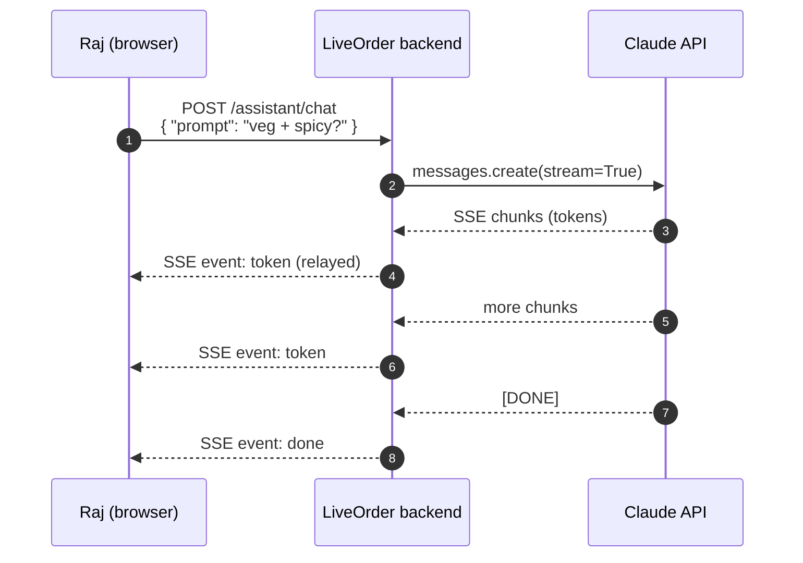
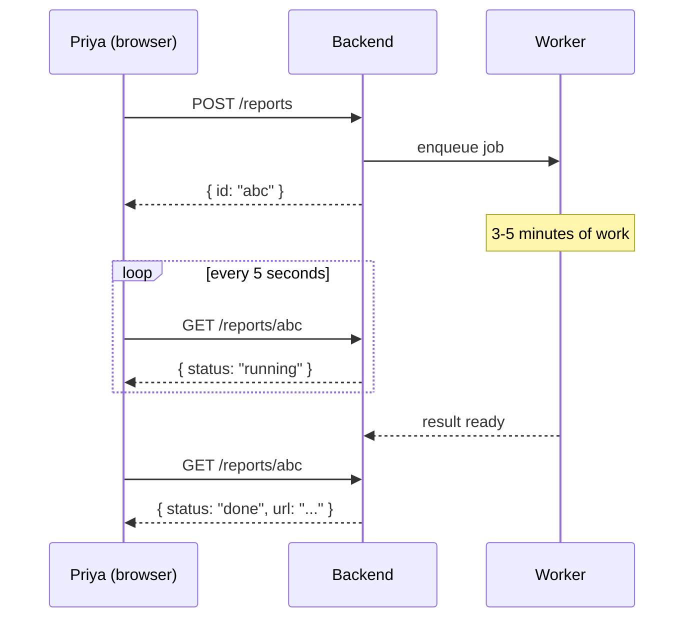
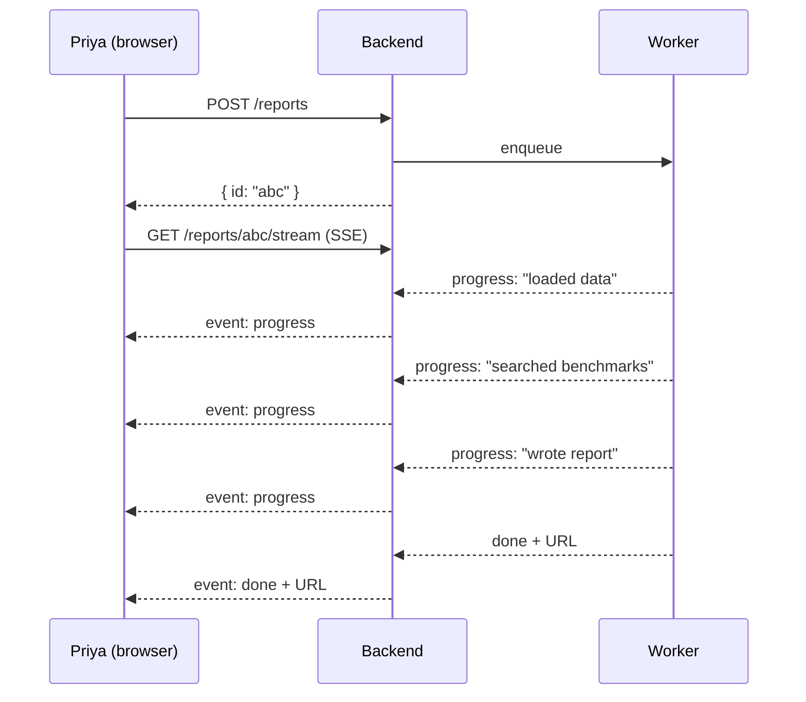
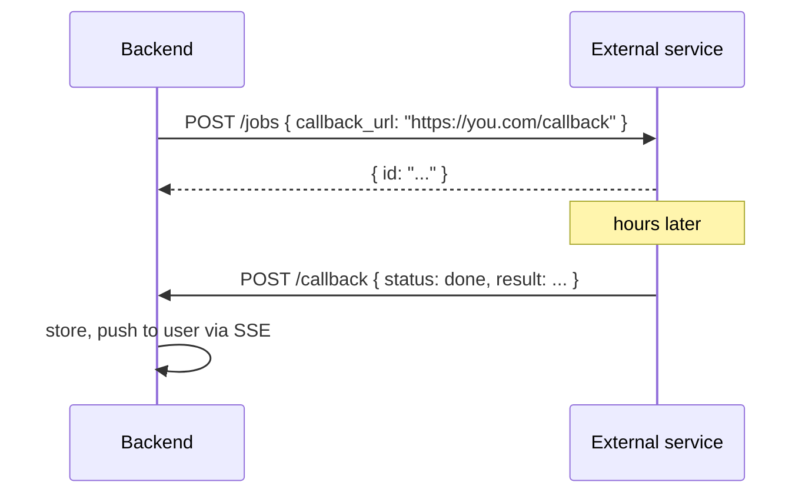
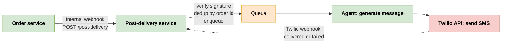
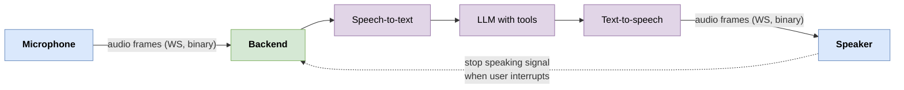
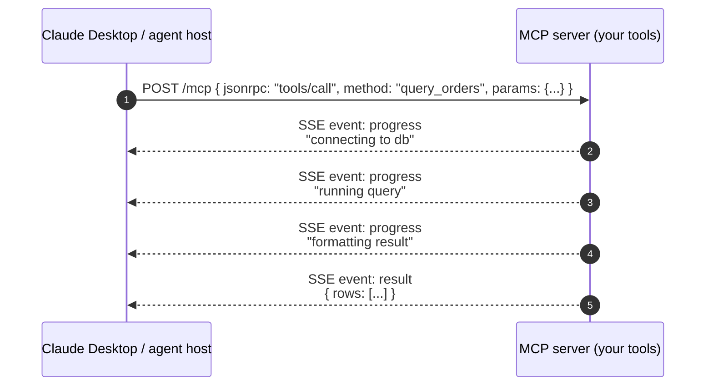
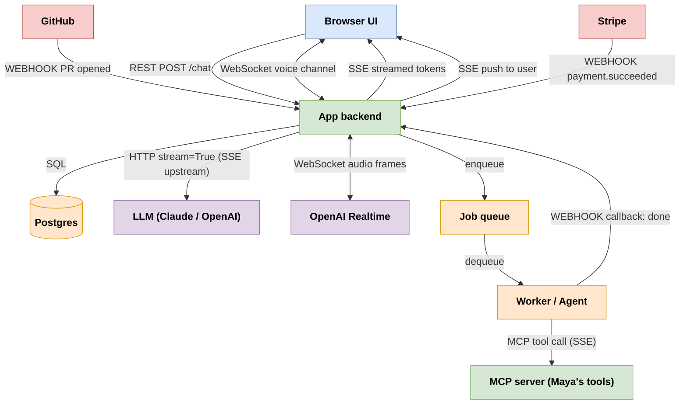

# 7. Real-Time Patterns in AI Apps, Agents, and MCP

> These four patterns are the hidden plumbing of every AI app you've ever used. This page maps each pattern to where it actually shows up in modern AI architectures, with full scenarios you can copy.

---

## What you'll learn

- Why AI apps make these decisions harder than traditional CRUD apps
- Five complete scenarios with full architecture sketches: LLM streaming, long-running agent tasks, external-event-triggered agents, voice agents, MCP servers
- How a single real AI app composes all four patterns
- The specific decisions OpenAI, Anthropic, Cursor, and Claude Desktop made and why

---

## 7.1 Why AI apps are different

For a CRUD app, the decision tree is usually simple - REST for most things, maybe a webhook or two for payments, maybe an SSE feed for live notifications. Done.

AI apps push every choice harder, for three reasons:

1. **LLM output is naturally a stream.** Static REST feels broken after you've seen ChatGPT type out its answer. Once your users have experienced streaming, batch responses feel laggy even when they're objectively fast.

2. **Tools can take seconds to minutes.** The agent runs a web search (5 sec), reads 3 docs (15 sec), summarises (10 sec), generates a report (30 sec). The user is staring at a screen the entire time. Your UX needs to communicate "I'm doing things" with the same depth your kid asks "are we there yet."

3. **Agents are increasingly triggered by external events.** GitHub fires → agent reviews PR. Stripe fires → agent processes refund. Slack fires → agent answers a question. These are webhooks. Lots of webhooks.

So the patterns matter more in AI apps than in any other category of software. Pick wrong and your agent feels laggy, expensive, or unreliable.

---

## 7.2 Scenario 1 - Streaming an LLM response to a user

**Setup.** Raj is using LiveOrder's AI assistant to ask "What's good for vegetarians who like spicy food?" The agent calls Claude to generate an answer.

**Naive approach**: send the request, wait 4 seconds, render the full response. Users immediately complain it feels broken.

**Right approach**: stream tokens as they're generated.

### The pattern: SSE

The data flow is one-way (model → user). The user clicked "send" via a normal REST POST. The reply streams back as SSE events. The browser's built-in `EventSource` reconnects automatically if the network blips.



Notice the backend is **two SSE clients glued together**: it consumes Claude's SSE stream, transforms each chunk into LiveOrder's own event shape, and sends it to Raj.

### Why not WebSocket?

WebSocket would work but adds complexity for no benefit:
- More framework setup (FastAPI WebSocket route, browser reconnection code).
- More state per connection.
- Doesn't get auto-reconnect for free.

The only reason you'd reach for WebSocket here is **interruption** (user wants to cancel mid-response). For chat assistants that allow stop-mid-response, see Scenario 4 (voice). For most LLM apps, SSE is the right call.

### Why not polling?

The latency is wrong by two orders of magnitude. Polling every 500 ms means tokens arrive in chunks of 500 ms instead of as they're produced. The typewriter feel is gone.

### Real-world: this is the OpenAI / Anthropic SDK shape

When you do `openai.chat.completions.create(stream=True)` or `anthropic.messages.stream(...)`, you're getting an SSE stream from their API. The SDK is essentially "an SSE client with JSON parsing on top." It's such a common pattern that the Vercel AI SDK and `@anthropic-ai/sdk` both expose ergonomic `useChat` and `stream` helpers that wrap SSE under the hood.

---

## 7.3 Scenario 2 - Agent kicks off a long-running task

**Setup.** Maya is building a new feature: "Give me a weekly report of how my restaurant compared to similar restaurants." Priya the restaurant owner clicks the button. The agent runs:

1. Pull last week's order data.
2. Compute statistics.
3. Search for benchmark data on similar restaurants.
4. Synthesise a report.
5. Email it as a PDF.

Total time: 3-5 minutes. The user clicked once. The UI has to feel responsive throughout.

### Three valid approaches

#### Option A: Polling (simplest)

Fire the job. Get back a job ID. Poll for completion.



UX: spinner, eventually a "done" toast. No progress detail. Works in 100 lines of code.

#### Option B: SSE for progress (better UX)

Same job, but stream progress events as they happen.



UX: live updating list of steps with a checkmark next to each as it completes. Feels much faster even though the total time is the same. (This is "perceived latency optimisation" - if the user sees progress, they wait happily; if they see a static spinner, they refresh the page.)

#### Option C: Webhook callback (when the worker is external)

If the long-running work is on a service you don't control (e.g. you submitted to OpenAI Batch API), give that service a `callback_url`. When done, the service POSTs to your URL.



This is webhooks again - the service is acting like Stripe, calling your URL when something fires.

### Maya's choice

For a 3-5 minute report, **Option B (SSE for progress)** is the sweet spot. Priya gets the typewriter-style "I'm doing X now" UX that AI apps have trained users to expect. The implementation is maybe 1.5x the code of polling.

If the job were 30+ seconds and the user was on mobile (likely to background the app), Maya would add Option C - the worker calls a webhook with the result, which then triggers a push notification.

---

## 7.4 Scenario 3 - External event triggers an agent

**Setup.** A new LiveOrder customer (let's say a small restaurant chain) sends 50 orders an hour. Each order needs a quick AI-generated "thank you" message tailored to what they ordered. Maya can't have a human in the loop.

Today the flow is: order placed → restaurant accepts → goes out → delivered. Maya wants to add an automated "personalised thank you" SMS right after delivery.

### The trigger

Maya has a webhook from her own system: when an order moves to status `delivered`, she fires an internal webhook to her "post-delivery" service.

That post-delivery service is the agent. Its trigger is the webhook.



This pattern (webhook → queue → agent → external call → webhook back) is the **default shape of an agent that reacts to events**. Each arrow respects the rules:

- Webhooks are signed.
- Receivers return 200 fast, dedup by ID, queue the work.
- The agent runs in a worker so the webhook handler isn't blocked.
- External API calls (Twilio in this case) themselves fire webhooks back when status changes.

### Three places people get this wrong

1. **Doing the LLM call inside the webhook handler.** LLM calls take 1-5 seconds. The webhook sender will time out at 5-10 seconds. You'll get retries, double-sent SMS, angry customers. Always queue.

2. **Not deduping.** If you process the same `order delivered` webhook twice, you send two SMSes. Customer is annoyed and Twilio bills you twice. Dedup by `order_id + status_transition`.

3. **No idempotency on the LLM side.** Even if you dedup the webhook, two workers might race on the same job. Wrap the agent call in a database transaction that checks "has this already been sent?" before sending.

---

## 7.5 Scenario 4 - Voice or interactive bidirectional agent

**Setup.** LiveOrder is rolling out a phone hotline where customers can call and place orders by voice. The voice agent listens, understands, responds, and books the order.

This needs:
- Audio in (the customer speaking).
- Audio out (the agent speaking back).
- Mid-stream interruption (the customer says "wait, no, I want medium spice" while the agent is reading back the order).

### The pattern: WebSocket



WebSocket is the only pattern that works here:

- **Binary support.** Audio is binary. SSE is text-only.
- **Both directions.** Sound in, sound out.
- **Low latency.** Voice needs sub-300 ms end-to-end to feel natural.
- **Mid-stream control.** The "stop speaking" signal goes upstream while audio is going downstream.

### Real-world: this is OpenAI Realtime, ElevenLabs Conversational, Twilio Media Streams

Every modern voice agent uses WebSocket. There's no real alternative.

### What makes this hard

Voice agents are state-of-the-art real-time infrastructure. You're juggling:

- Microphone capture with low buffering.
- Voice activity detection (when did the user start/stop speaking?).
- Streaming ASR (transcribe as audio arrives, don't wait for end-of-utterance).
- Streaming LLM responses (generate while ASR is still finishing).
- Streaming TTS (start speaking before the LLM is done).
- Interruption handling (cancel TTS when user starts speaking).

All over one WebSocket. The infrastructure work behind this is enormous.

If you're building voice, use a managed service (Vapi, Retell, ElevenLabs Conversational) unless you have a really specific reason. Doing it from scratch with raw OpenAI Realtime + your own ASR is a multi-month project.

---

## 7.6 Scenario 5 - MCP (Model Context Protocol) server

**Setup.** Maya wants Claude Desktop to be able to query LiveOrder's database directly. "How many vegetarian orders did Priya's restaurant have last week?"

She builds an MCP server that exposes a `query_orders` tool. Claude Desktop launches the server (locally via stdio, or remotely via HTTP) and can now call the tool.

### What is MCP, briefly

MCP is a standard protocol for LLM hosts (Claude Desktop, Cursor, custom agents) to call tools defined by servers. The host doesn't know what the server does; it just knows the tool's name, parameters, and how to call it. The server runs the actual code.

### Three transports

MCP has evolved through three transport mechanisms:

1. **stdio.** Server is a local process; messages flow over its stdin/stdout. Used for "local" tools (filesystem, git, sqlite). Not really one of our four patterns - it's pipes between processes on the same machine.

2. **HTTP + SSE (older two-endpoint design).** Client makes one HTTP request to open an SSE stream (server → client events). Client sends messages via a separate HTTP POST. Two endpoints, one connection each direction. **This is just SSE + REST glued together.**

3. **Streamable HTTP (current standard).** A single endpoint where the response body is itself an SSE stream. Bidirectional flow is multiplexed via paired POSTs and SSE responses. Still SSE-shaped underneath.

### Why SSE-based?



The shape of MCP calls fits SSE perfectly:

- **Tool calls take time** (database queries, web searches, etc.). Progress streaming is natural.
- **One request, many response events.** Search → 10 result items → final summary. SSE was built for exactly this.
- **Plain HTTP.** No WebSocket upgrade required. Easy to host anywhere - serverless platforms, Cloud Run, anything that supports streaming HTTP responses.

### Why not WebSocket?

The "bidirectional" needs of MCP are coarse-grained (call → many responses), not fine-grained (constant back-and-forth like a chat). Each tool call is essentially request/response, with the wrinkle that the response is many events. SSE's "one request, many events" model is exactly the right primitive.

WebSocket would add complexity (sticky sessions, heartbeats, framing) for no benefit.

### Maya's MCP server in Python

```python
from mcp.server import Server
from mcp.types import Tool, TextContent

app = Server("liveorder")

@app.list_tools()
async def list_tools():
    return [
        Tool(name="query_orders", description="Query LiveOrder's order database",
             inputSchema={"type": "object", "properties": {
                 "restaurant_id": {"type": "integer"},
                 "days": {"type": "integer"},
             }, "required": ["restaurant_id"]})
    ]

@app.call_tool()
async def call_tool(name: str, arguments: dict):
    if name != "query_orders":
        raise ValueError(f"unknown tool {name}")

    # The MCP framework streams progress events for you
    rows = await db.query_orders(arguments["restaurant_id"], arguments.get("days", 7))
    return [TextContent(type="text", text=f"Found {len(rows)} orders\n{format_table(rows)}")]
```

Claude Desktop's user clicks "yes, run this tool", the MCP framework handles the SSE transport, Claude receives the result, weaves it into its response. The whole MCP layer is essentially SSE underneath.

---

## 7.7 A complete AI app - all four patterns at once

Let's see what LiveOrder's full AI feature set looks like at the architecture level. **Every arrow is labelled with which pattern carries it.**



The same backend exposes:

- **REST** for sending chat messages, fetching history, simple CRUD.
- **SSE** for streaming tokens to the UI, pushing job-progress updates, broadcasting order status changes.
- **WebSocket** for voice agent traffic (binary, bidirectional, interruptible).
- **Webhooks** as the inbound trigger from GitHub, Stripe, and the worker reporting back when long jobs finish.
- **MCP (over SSE)** for tools the worker calls.

Look at the labels. **All four patterns coexist in one app, each chosen because it's the right shape for that piece of data flow.**

---

## 7.8 Real-world appearances (the index)

| Product | Pattern | What for |
|---------|---------|----------|
| OpenAI `stream=True` | SSE | Token streaming |
| OpenAI Realtime API | WebSocket | Voice (bidirectional audio) |
| Anthropic Messages API streaming | SSE | Token streaming |
| Claude Desktop ↔ MCP servers | stdio / SSE / Streamable HTTP | Tool calls and progress events |
| GitHub Copilot Chat | WebSocket | Bidirectional agent conversation |
| Cursor agent panel | WebSocket | Persistent agent session |
| Vercel AI SDK `useChat` | SSE | Chat response streaming |
| LangSmith / LangFuse live traces | SSE | Streaming trace events to dashboard |
| GitHub webhooks | Webhook | Repo events → CI/agent triggers |
| Stripe webhooks | Webhook | Payment events → fulfillment agents |
| Slack Events API | Webhook | Message events → bots |
| Vercel deploy logs | SSE | Live build output |
| OpenAI Batch API | Polling (or webhook callback) | Long batch jobs |

If you find yourself wondering "how does this app feel so live?", look at the network tab. 80% of the time it's SSE. 15% it's WebSocket. 5% it's clever polling.

---

## 7.9 Five questions to ask when building an AI feature

1. **Where does the trigger come from?**
   - User action → REST, SSE, WebSocket.
   - External event → Webhook.
   - Time-based → Cron / scheduler.

2. **Is the output stream-friendly?**
   - Token-by-token text → SSE.
   - Binary audio / video / images → WebSocket.
   - Single final result (under 1 second) → REST.

3. **Can the user interrupt mid-response?**
   - Yes → WebSocket (you need a client → server signal mid-stream).
   - No → SSE is enough.

4. **How long does the work take?**
   - Under 2 seconds → just REST; users won't notice.
   - 2-30 seconds → SSE for progress.
   - 30 seconds to minutes → background job + SSE for progress + webhook back for completion.
   - Hours to days → webhook callback only; the user goes about their day.

5. **How many concurrent users?**
   - Under 100 → anything works.
   - 100-10K → SSE is the sweet spot for streaming.
   - Over 10K → pub-sub backbone; consider managed services for WS if you go that route.

---

## 7.10 What this means for you

If you're building AI apps:

- **Default to SSE for streaming LLM output.** Cheap, browser-native, auto-reconnect for free.
- **Use webhooks for external triggers.** Sign payloads, dedup, return 200 fast.
- **Use WebSocket only when truly needed.** Voice. Mid-stream interruption. Binary frames. Anything else, SSE.
- **Use polling for slow batch checks.** No shame in it; sometimes it's exactly right.
- **MCP servers are SSE.** If you're building tools for Claude, you're writing SSE-shaped responses.

Build agents the same way you'd build any production system:

- Validate, dedup, and return fast at every webhook handler.
- Stream progress so the UX feels responsive even when the work is slow.
- Reconnect gracefully and resume from `Last-Event-ID`.
- Plan for failure: connections drop, providers go down, retries happen.

Pick the pattern that matches the shape of the data flow - not the one that sounds coolest in your architecture deck.

---

## 7.11 Cheat sheet

- **LLM token streaming** = SSE
- **Long-running agent task progress** = SSE (or polling for simple cases; webhook callback when fully async)
- **External event triggers agent** = Webhook → queue → agent (never inline)
- **Voice or interruptible streaming** = WebSocket
- **MCP server tools** = SSE / Streamable HTTP
- **Composite app** = all four, mix and match by feature

Go forth and build.
