# Diagrams - visual index

14 focused diagrams covering the four real-time patterns and how they fit together. Each has two formats:

- **`.drawio`** - editable source. Open in [app.diagrams.net](https://app.diagrams.net) or the VS Code drawio extension.
- **`png/*.png`** - pre-rendered images (2x scale). What you see below.

To regenerate from the Python source:

```bash
python _build.py             # regenerates .drawio files from a single style guide
python _qa.py                # validates layout, bounds, no overlaps
bash _export_pngs.sh         # exports PNGs (requires drawio CLI installed)
```

---

## 1. HTTP basics

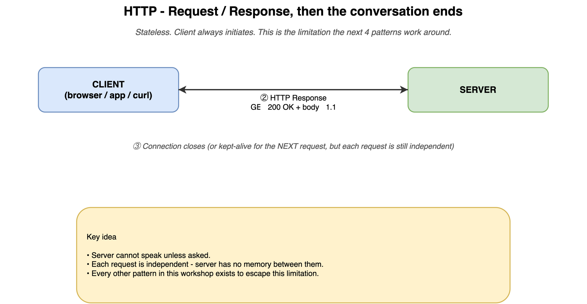

The baseline. One request, one response, connection closes. Why the next 4 patterns exist.

---

## 2. Short polling

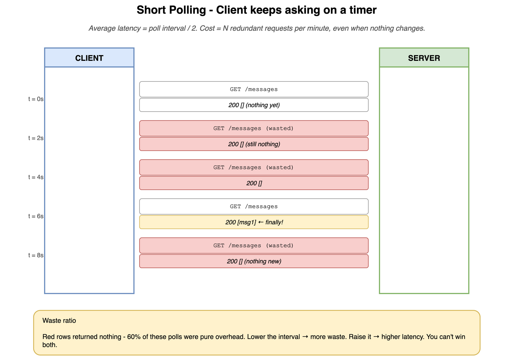

Client keeps asking on a timer. Red rows = wasted polls. Yellow = "finally got data". 60% waste ratio is typical.

---

## 3. Long polling

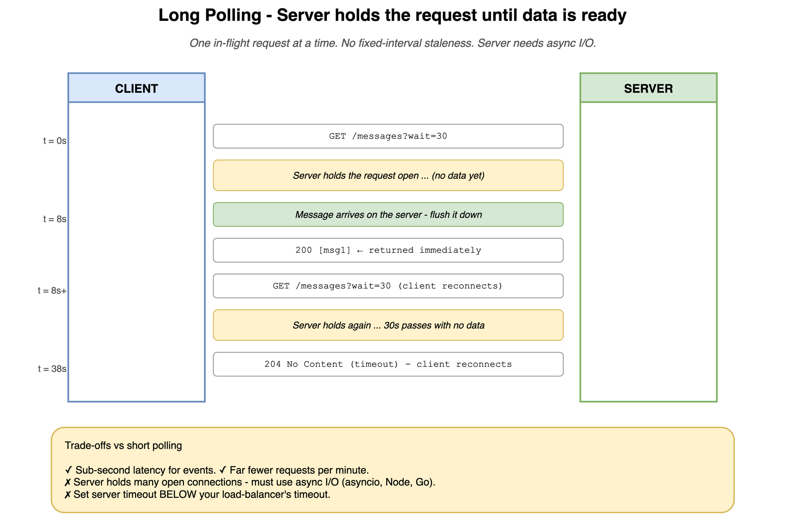

Server holds the request open until data is ready. Sub-second latency, far fewer requests, but needs async I/O on the server.

---

## 4. Short vs long polling - side by side

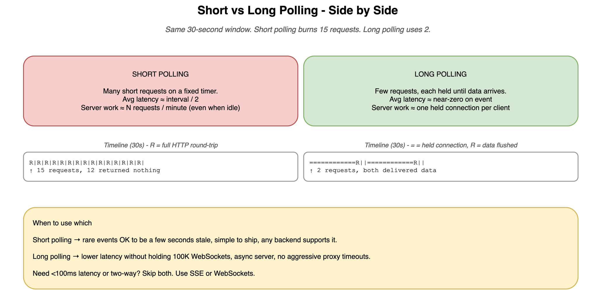

Same 30-second window. Short polling fires 15 requests. Long polling uses 2.

---

## 5. Webhook - the inversion

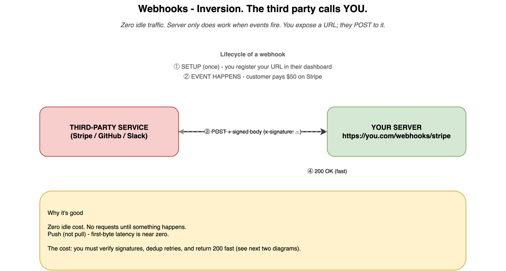

Third party POSTs to YOUR URL when something happens. Zero idle traffic.

---

## 6. Webhooks - retries and idempotent dedup

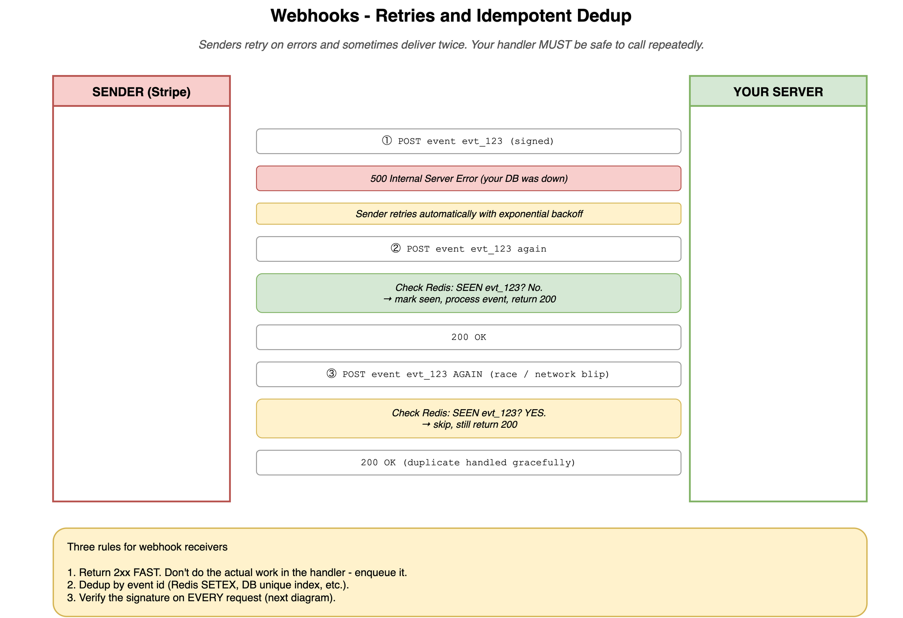

Senders retry on errors and sometimes deliver twice. Your handler must be safe to call repeatedly. Three rules: return 2xx fast, dedup by event id, verify the signature.

---

## 7. Webhooks - HMAC signature verification

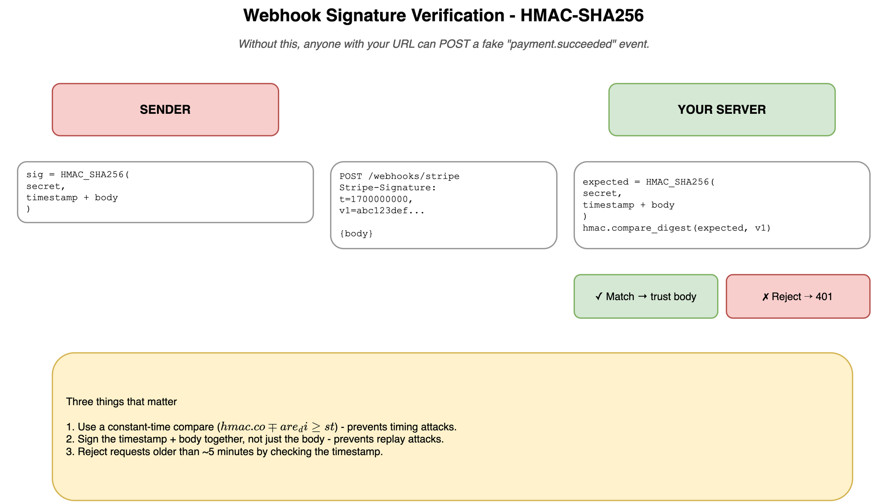

Without this, anyone with your URL can POST fake events. Constant-time compare. Include the timestamp to prevent replay attacks.

---

## 8. Server-Sent Events (SSE)

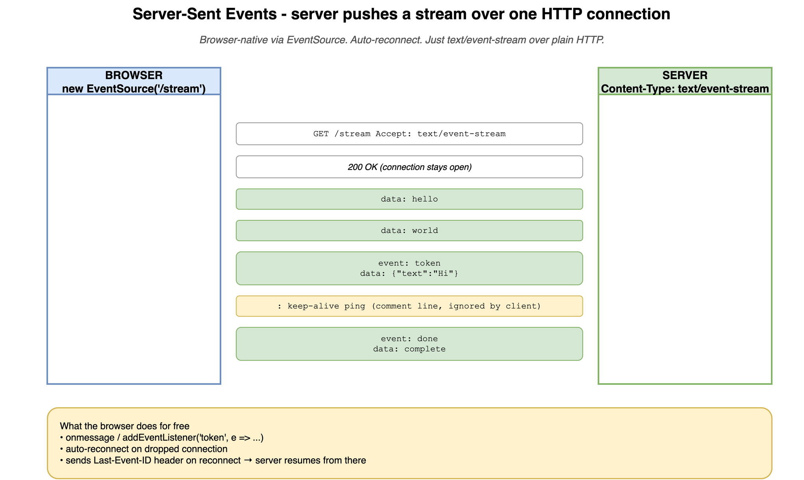

Server holds one HTTP connection open and pushes events down it. Browser handles parsing and auto-reconnect for free.

---

## 9. SSE auto-reconnect with Last-Event-ID

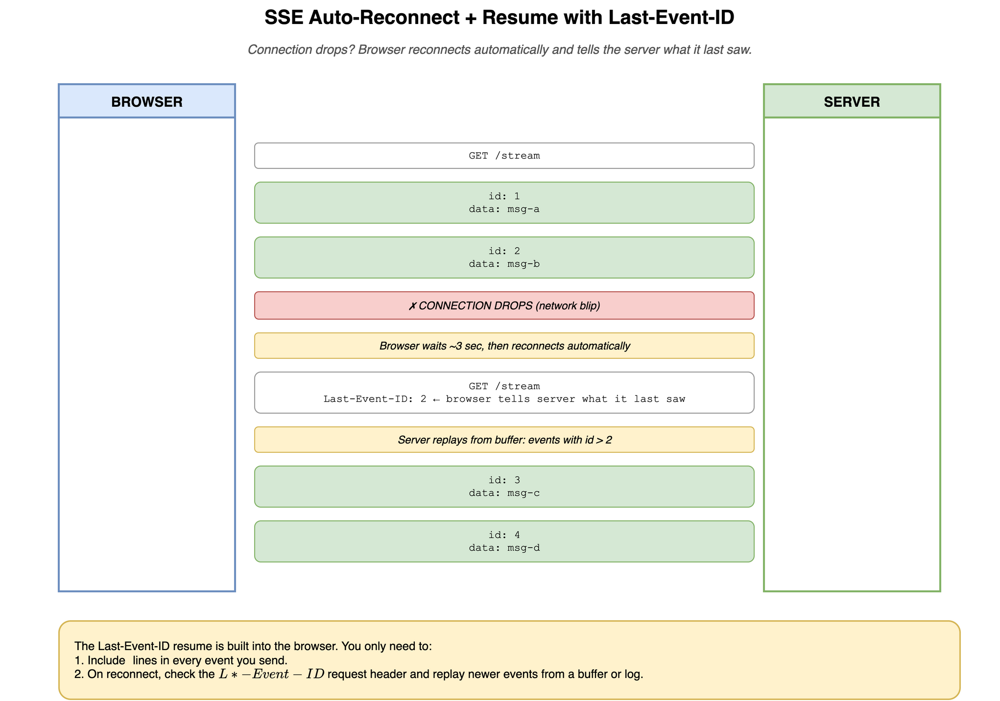

Connection drops, browser reconnects automatically and tells the server "last thing I saw was id 2". Server replays from its buffer.

---

## 10. WebSocket handshake + frames

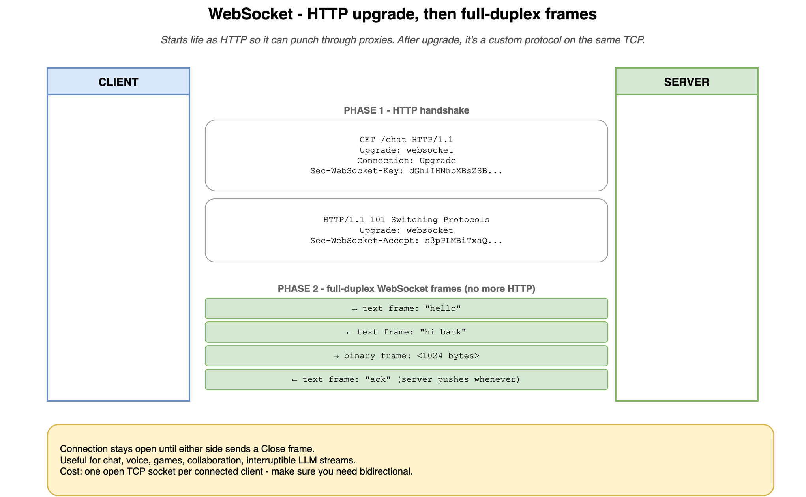

Two phases. Phase 1: HTTP handshake to upgrade the connection. Phase 2: WebSocket frames flow in both directions until either side closes.

---

## 11. WebSocket broadcast topology

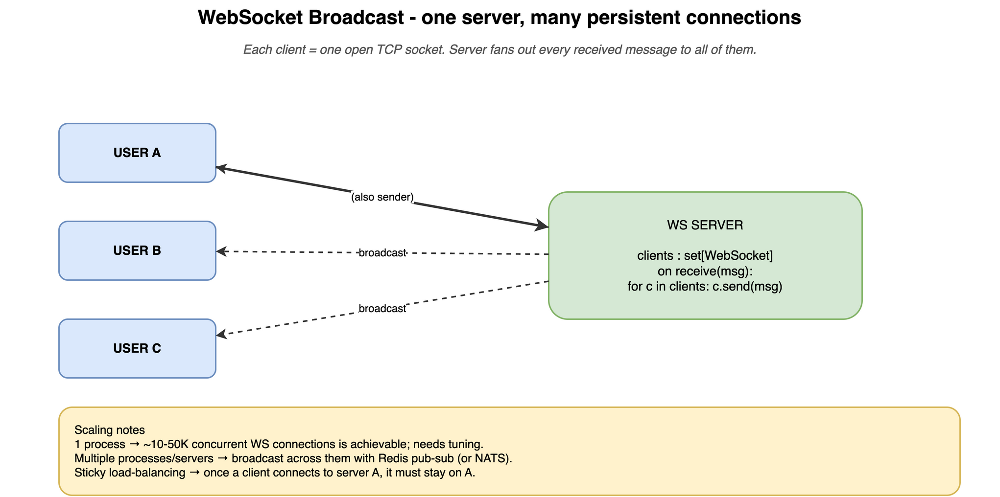

One server, many persistent connections. Server fans out every received message to all subscribers. Multi-process? Add Redis pub/sub.

---

## 12. Decision tree - which pattern when?

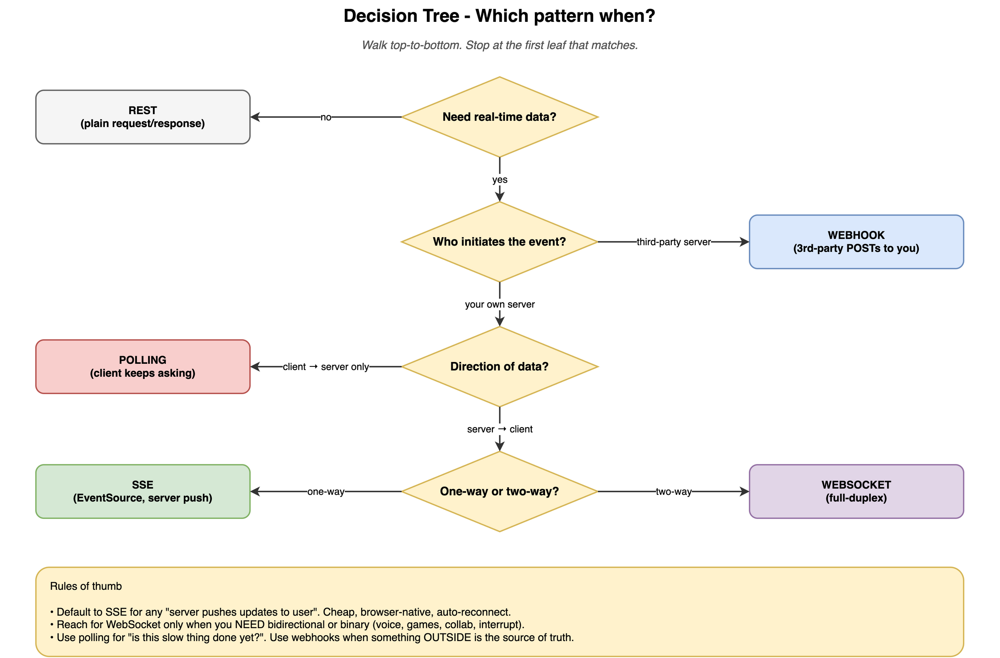

Walk top to bottom, stop at the first leaf that matches. SSE is the default for server-to-client streaming; WebSocket only when you genuinely need bidirectional.

---

## 13. A real AI app uses ALL four patterns

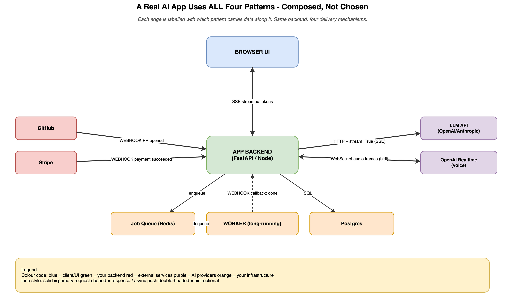

Each edge is labelled with the pattern carrying it. REST + SSE + WebSocket + Webhook coexist in one app.

---

## 14. MCP architecture (Model Context Protocol)

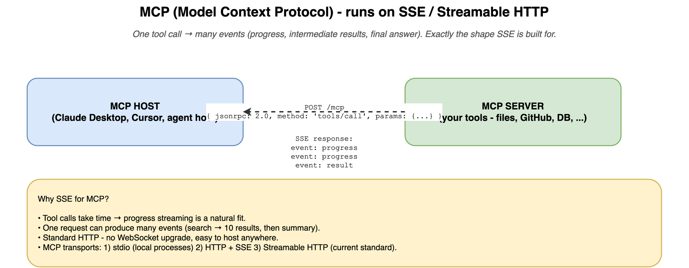

How Claude Desktop and other LLM hosts call MCP server tools. Built on SSE / Streamable HTTP because one tool call produces many progress events.
